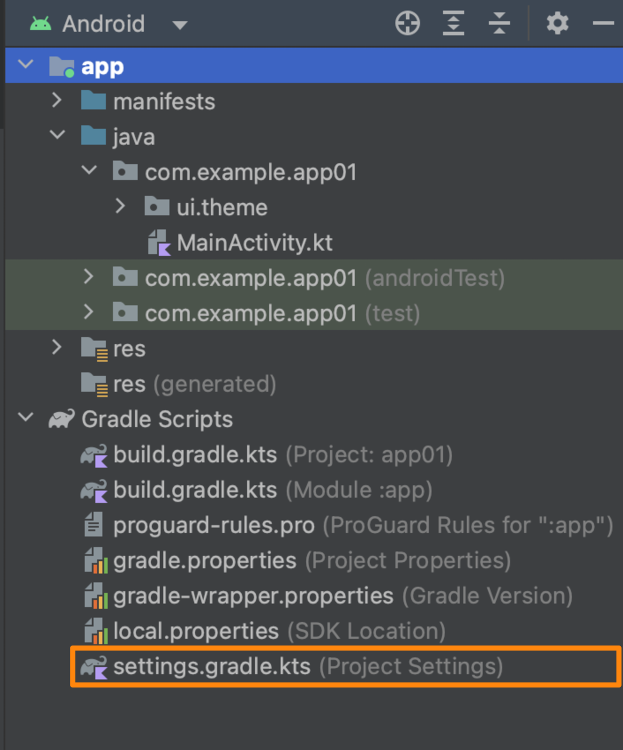
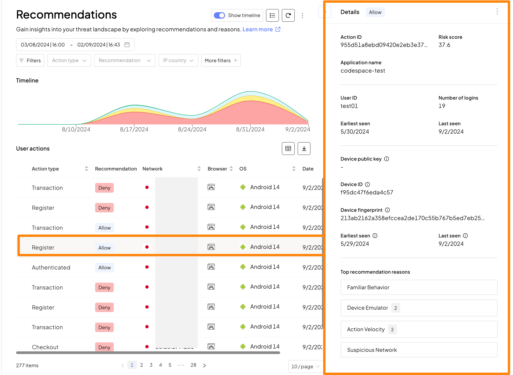
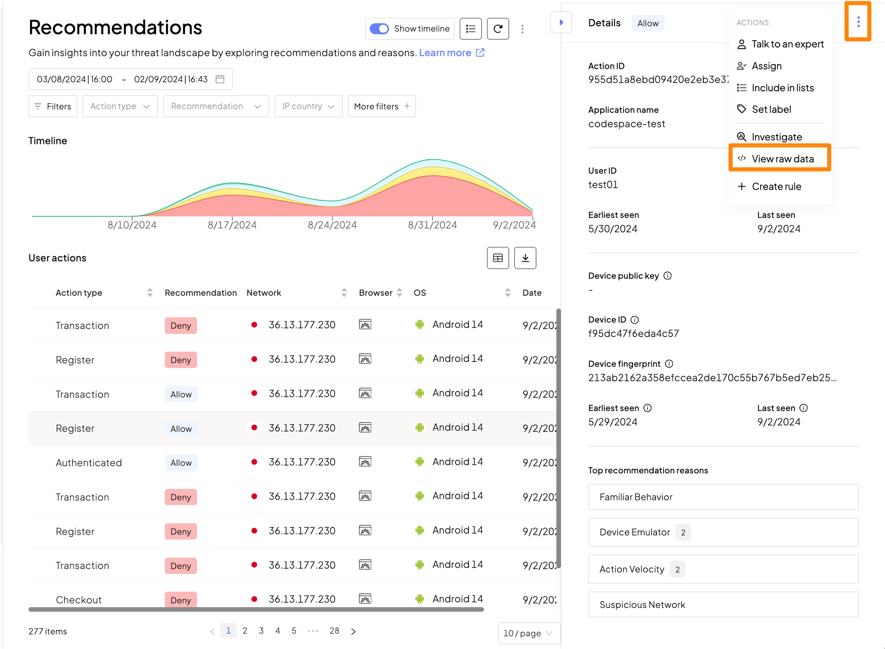

# Detection and Response Service: Android SDK

## はじめに
- 本ドキュメントでは[Android SDK](https://developer.transmitsecurity.com/guides/risk/quick_start_android/)でDetection and Response Serviceを利用する手順を示します
- 本ドキュメントでは、以下環境を利用した実装サンプルを示しています。利用言語や環境に合わせて進めてください
  - Android Studio Giraffe | 2022.3.1 Patch 1 (Build #AI-223.8836.35.2231.10671973, built on August 17, 2023)
  - アプリケーションデプロイ時のSDK、言語
    - SDK: API 24("Nougat"; Android 7.0)
    - Language: Kotlin DSL (build gradle.kts)
  - その他利用言語の情報
    - Base Language: Kotlin
    - Android UI: JetPack
    - Build System / Android Package: gradle

> **warning**
> 本手順は2023/09/06時点の参考手順となります。
> Androidの実装方法や、Android Studio機能は変更されることがありますので、適宜最新の情報を確認してください
> また、その変更に合わせて TransmitSecurityの[Android SDK quick start](https://developer.transmitsecurity.com/guides/risk/quick_start_android/)内容も変更になる場合があります。合わせてご確認ください

### 事前準備・前提
- 本ドキュメントでは以下が必要となります
  - インターネットに接続可能な端末
  - 手順に応じた簡易なCLI操作・ファイル編集
- Android Studio, JVM(Java)
- [Transmit Security Platformでアプリケーションのセットアップ](./setup.md)で適切にアプリケーションの登録を完了していること

## Android Sample Applicationのデプロイ
### サンプルアプリケーションの実行
- はじめにAndroid Studioを利用したサンプルアプリケーションのデプロイ手順を確認します
- Android Studioを起動し、`New Project`を開きます
- 画面に表示されたサンプルの中から`Empty Activity`をクリックします

  

- `Name`に適当な名前文字列(ex: app1)を入力し、`Finish`をクリックします。その後Projectが立ち上がります

  

### Android サンプルアプリケーションの動作確認

- 画面右上のメニューを確認します。左から`実行するアプリケーション`、`Emulateする端末`、そして`各種メニュー`となっています

> デバイスが選択されていない場合
> - プルダウンより`Device Manager`をクリックします
>   <p></p>
> - 右に表示された画面より`create Device`をクリックします
>   <p></p>
> - メニューより適当な端末・OSを選択します
>   <p></p>
>   <p></p>
> - デバイス選択後、画面右上`-`をクリックし、メニューを隠します
>   <p></p>

- `▶️`ボタンをクリックし、アプリケーションをEmulateした端末上で実行します

  

- 一定時間経過後、実行結果が画面右側に表示されます。別窓で端末の状態を表示したい場合には、画面右上の`Window`をクリックしてください

  

- 画面にはアプリが実行され`Hello World!`の文字が表示されていることがわかります

- Android Stduio右上のメニューの`◼️`ボタンをクリックし、動作を停止させます

  

## Detection and Response Service Android SDK の読み込み

### Detection and Response Service Android SDK の読み込み

- Detection and Response Service Android SDKを読み込むため以下の記述を追加します

- `settings.gradle.kts`の`dependencyResolutionManagement`、`repositories`配下に以下の内容を追記します

  

  ```kotlin
  maven {
      url = uri("https://transmit.jfrog.io/artifactory/accountprotection-gradle-release/")
  }
  ```

- ``参考``: 追記した結果、以下のようになります

  


- `build.gradle.kts`の`dependencies`配下に以下の内容を追記します

  

  ```kotlin
      implementation("com.ts.sdk:accountprotection:1.0.+")
  ```

- ``参考``: 追記した結果、以下のようになります

  

### UIの記述を変更

- UIの設定を記述しているファイル`MainActivity.kt`の内容を変更します

  

- 先ほど追加したライブラリおよび、サンプルアプリケーションを動作させるため、`import ...`末尾に以下の内容を追記してください

  ```kotlin
  import android.util.Log
  import androidx.compose.foundation.layout.Column
  import androidx.compose.foundation.layout.Row
  import androidx.compose.material3.Button
  import com.transmit.accountprotection.ITransmitSecurityTriggerActionEventCallback
  import com.transmit.accountprotection.TSAccountProtection
  import com.transmit.accountprotection.TSAccountProtection.triggerAction
  import com.transmit.accountprotection.TransmitSecurityTriggerActionResponse
  import com.transmit.accountprotection.api.ActionEventOptions
  import com.transmit.accountprotection.errors.TransmitSecurityAccountProtectionError
  ```
- ``参考``: 追記した結果、以下のようになります

  

- class MainActivity 以下の変更を行います

- `class MainActivity : ComponentActivity() {`の直前に以下の内容を貼り付けます。以下コメントを参考に値を修正し、貼り付けてください。

  - `[CLIENT_ID]`: Transmit Platformでアプリケーションを作成し取得した値を貼り付けてください

  ```kotlin
  import android.app.Application;

  class MainApplication: Application() {
      override fun onCreate() {
          super.onCreate();
          TSAccountProtection.init(this, "https://collect.riskid.security/device/", "{CLIENT_ID}");
      }
  }
  ```

- ``参考``: 追記した結果、以下のようになります

  

- AndroidManifest.xml 以下の変更を行います

- `<application` の直後に以下の内容を貼り付けます。

  ```kotlin
          android:name=".MainApplication"
  ```


- ``参考``: 追記した結果、以下のようになります

  

- `fun Greeting(...)`の内容を変更します。`@Composable`直下に以下の内容を貼り付けます。以下コメントを参考に値を修正し、貼り付けてください。
  - `[USER_ID]`: 記録するセッションのUserIDを指定します。今回は動作確認が目的のため固定の文字列`test01`を指定します

  ```kotlin
  //@Composable直下、Greeting以降の内容を書き換え
  fun Greeting(name: String, modifier: Modifier = Modifier) {
  
      Column (
          modifier = modifier,
          //horizontalAlignment = Alignment.CenterHorizontally
      ) {
          Text(
              text = "Set / Unset User ID",
          )
          Row {
              Button(onClick = {
                  Log.e("tap","setuser")
                  var userid = "[USER_ID]"
                  TSAccountProtection.setUserID("$userid")
              }) {
                  Text("setuser")
              }
              Button(onClick = {
                  Log.e("tap","unsetuser")
                  TSAccountProtection.clearUser()
              }) {
                  Text("unsetuser")
              }
          }
          Text(
              text = "Report Action Button",
          )
          Row {
              Button(onClick = { tsButtonClick("register") }) {
                  Text("register")
              }
              Button(onClick = { tsButtonClick("transaction") }) {
                  Text("transaction")
              }
              Button(onClick = { tsButtonClick("checkout") }) {
                  Text("checkout")
              }
          }
      }
  
  }
  
  public fun tsButtonClick(type: String){
      Log.e("tap","Action Type $type")
  
      triggerAction("$type", object : ITransmitSecurityTriggerActionEventCallback {
          override fun onResponse(transmitSecurityTriggerActionResponse:   TransmitSecurityTriggerActionResponse) {
              val token = transmitSecurityTriggerActionResponse.token()
              Log.e("token","Action Token:$token")
          }
  
          override fun onFailed(transmitSecurityAccountProtectionError:   TransmitSecurityAccountProtectionError) {
              val error = transmitSecurityAccountProtectionError.errorMessage
              Log.e("error","Error:$error")
          }
      })
  }
  
  ```
- ``参考``: 追記した結果、以下のようになります

  

## SDKをデプロイしたAndroidアプリケーションの動作確認

### Gradle FileのSync

- Gradleに追加した、Android SDKを読み込むため`Sync`を実行します
- 画面右上の`Sync`ボタン、または警告メッセージの`Sync Now`をクリックしてください

  

### Android アプリケーションの実行

- `▶️`ボタンをクリックし、アプリケーションをEmulateした端末上で実行します。Emulatorが起動中の場合は`◼️`ボタンをクリックし、動作を停止し、再度実行してください

  <p></p>

  <p></p>

- 一定時間経過後、実行結果が表示されます。

  

### Androidアプリケーションの操作

- 画面上部が`UserのSet / Unset`、下部が`ユーザとして通知するAction`となります
- 以下の順序でボタンをクリックした結果を確認します

- Set User
  1. `Set User`
  1. `register`
  1. `transaction`

  <p></p>

  <p></p>

- Unset User
  1. `Unset User`
  1. `register`
  1. `transaction`

  <p></p>

- `Set User`の`register`について詳細を確認します

  <p></p>

  <p></p>

- JSON右上のボタンをクリックすることにより、JSONの内容をコピーすることが可能です

### Android アプリケーションのログの確認

- 動作するアプリケーションのログを確認することが可能です。今回のサンプルコードでは、ボタンのクリックに合わせてログメッセージが記録されるコードとなっています
- 画面下部`logcat`を開き、次の操作に合わせてログメッセージが記録されることを確認してください

  


## Tips: UserIDのハッシュ化

> **warning**
> Transmit Security Platformへ通知するUserIDは、メールアドレスなどの個人情報を含めることを禁止されています

- `MainActivity.kt`の内容を変更します

- ハッシュを生成するため、`import ...`末尾に以下の内容を追記してください

  ```kotlin
  import java.security.MessageDigest
  ```

- UserIDのハッシュを生成するためのコードを`TSAccountProtection.setUserID...`の上に貼り付けてください

  ```kotlin
  userid = MessageDigest.getInstance("SHA-256")
      .digest(userid.toByteArray())
      .joinToString(separator = "") {
          "%02x".format(it)
      }
  ```

## 参考情報

- [Transmit Security Android SDK quick start](https://developer.transmitsecurity.com/guides/risk/quick_start_android/)
- [Transmit Security Android SDK](https://transmitsecurity.github.io/accountprotection-android-sdk/)
- [Develop Android apps with Kotlin](https://developer.android.com/kotlin)
- [Android Basics with Compose](https://developer.android.com/courses/android-basics-compose/course)
- [Android API Reference](https://developer.android.com/reference)

