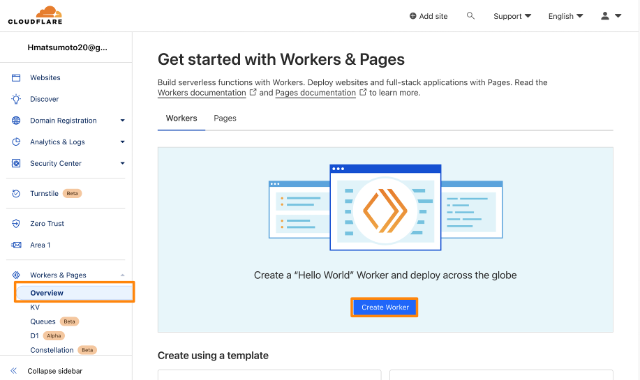
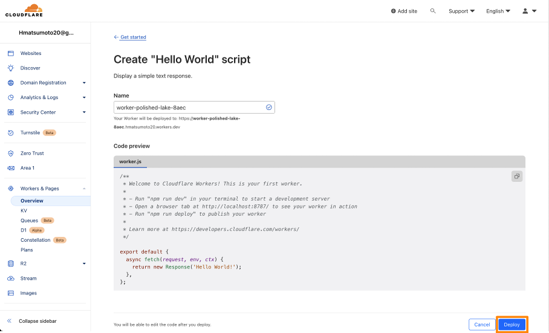
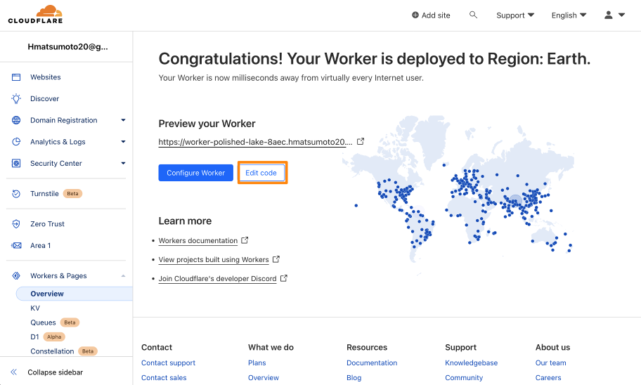
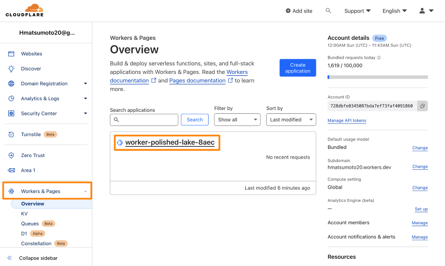
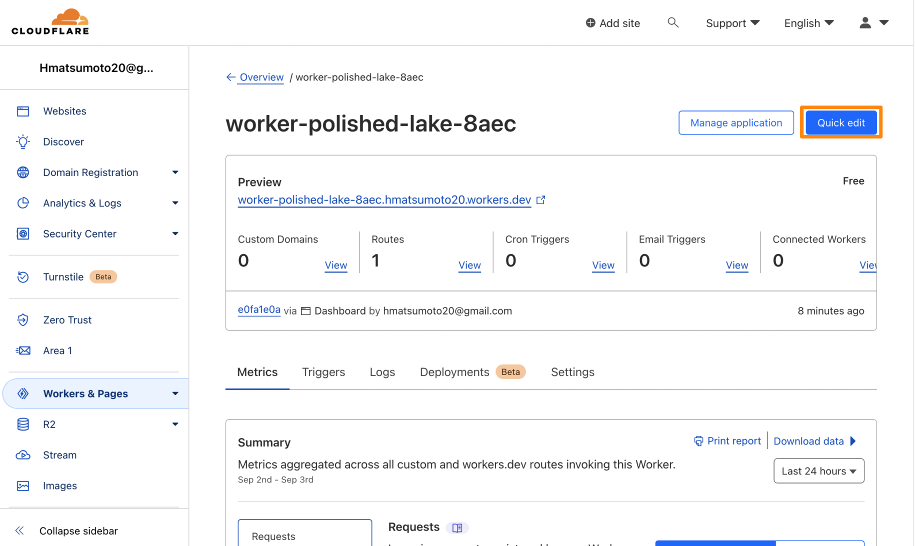
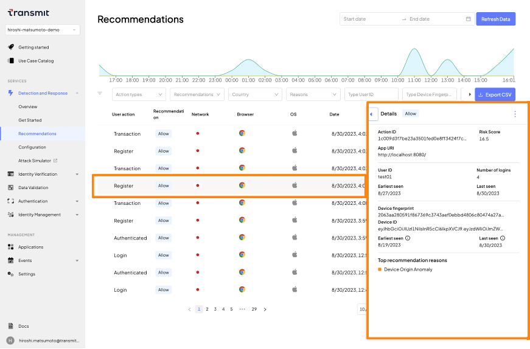
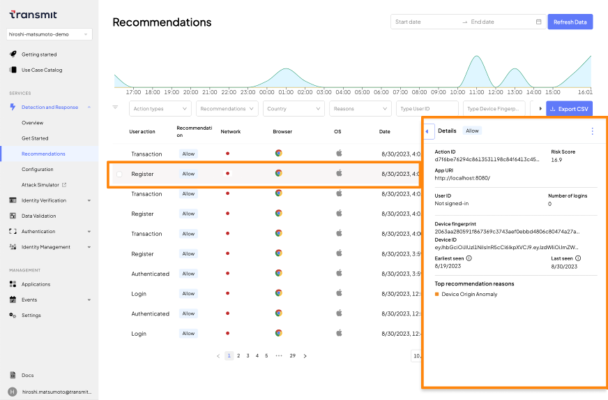

# Detection and Response Service: Cloudflare Worker

## はじめに
- 本ドキュメントでは[Cloudflare Workers](https://developer.transmitsecurity.com/guides/risk/quick_start_cloudflare/)でDetection and Response Serviceを利用する手順を示します

### 事前準備・前提
- 本ドキュメントでは以下が必要となります
  - インターネットに接続可能な端末
  - ブラウザ
  - 手順に応じた簡易なCLI操作・ファイル編集
- Cloudflare Account (Cloudflare Workerの利用のため)
- [Transmit Security Platformでアプリケーションのセットアップ](./setup.md)で適切にアプリケーションの登録を完了していること

## Cloudflare Workerの設定

- 段階的にCloudFlare Workerの動作確認をしながら進めていきます

> **Warning**
> 2023/09/03現在、[Cloudflare Workers](https://developer.transmitsecurity.com/guides/risk/quick_start_cloudflare/)のサンプルは`Service Worker Format`で記述されています。こちらの手順は`ES Format`となります。Cloudflare Workerの記述変更は[Migrate to ES modules format](https://developers.cloudflare.com/workers/learning/migrate-to-module-workers/)を参照してください


### Cloudflare Worker で最低限のアプリケーション(Hello World)の動作
- DSRの実装では内容を入れ替えますが、Cloudflare Workerの動作確認のため以下を実施します

- [Cloudflare dashboard](https://dash.cloudflare.com/) を開き、ログインしてください
- 左メニューより`Workers & Pages`を選択し、 画面中央の`Create Worker`をクリックしてください

  

- 画面最下部の`Deploy`をクリックしてください

  

- 画面中央に表示される`URL`をクリックすると、ブラウザで`Hello World!`の表示を確認できます

  

### Cloudflare WorkerにDetection and Response Serviceの記述を追加

- 記述内容を変更します。以下のいずれかの手順で編集画面を開いてください
  - 先ほどの画面の`Edit code`をクリックします

  

  - 左メニューより`Workers & Pages`を選択し、 先ほど作成したWorkerをクリックします。その後画面右上の`Quic edit`をクリックします

  

- Cloudflare Worker `worker.js` の欄にDetection and Response ServiceをInstall , 初期化するためのサンプルが以下となります。以下の内容を修正し、`worker.js` に貼り付けてください
  - `**CLIENT_ID**`: Transmit Platformでアプリケーションを作成し取得した値を貼り付けてください
  - `**USER_ID**`: 記録するセッションのUserIDを指定します。今回は動作確認が目的のため固定の文字列`test01`を指定します

  ```javascript
  export default {
    async fetch(request,env,ctx) {
        // fetch https://example.com 
        // add JavaScript and HTML to the response
        const originalResponse = await fetch("https://example.com");
        let response = new Response(originalResponse.body, {
            status: originalResponse.status,
            headers: originalResponse.headers,
        });
  
        let clientid = "**CLIENT_ID**"
        let userid = "**USER_ID**"
  
        let replacedTsPlatformSDK = ""
        replacedTsPlatformSDK = tsPlatformSDK.replace(/\[CLIENT_ID\]/g, clientid);
        replacedTsPlatformSDK = replacedTsPlatformSDK.replace(/\[USER_ID\]/g,   userid);      
        console.log(replacedTsPlatformSDK)
  
        // Change response body by adding tsPlatform SDK and Login Handler
        const originalBody = await originalResponse.text();
        let addSdkBody = originalBody.replace(/<\/head>/g, replacedTsPlatformSDK);
        let body = addSdkBody.replace(/<\/body>/g, tsPlatformHTML);
  
        response = new Response(body, response);
        return response;
    },
  };
  
  const tsPlatformSDK = `
  <script src="https://platform-websdk.transmitsecurity.io/platform-websdk/latest/ts-platform-websdk.js" defer="true" id="ts-platform-script"></script>
  <script>
  console.log("Setting up event listener for script loading");
  document.getElementById("ts-platform-script").addEventListener("load", function(e) {
        console.log("tsPlatform ready");
        window.tsPlatform.initialize({ clientId: "[CLIENT_ID]" })
  });
  </script>
  <script>
    // SDK Set User
    async function setDRSUser() {
      let userid = "[USER_ID]"
      window.tsPlatform.drs.setAuthenticatedUser(userid);
      console.log("setAuthenticationUser")
    }
    // SDK reportAction
    async function reportAction(actionType) {
      window.tsPlatform.drs.triggerActionEvent(actionType).then((actionResponse) => {
        let actionToken = actionResponse.actionToken;
        console.log("Action Type:"+actionType+",Token:"+actionToken)
      });
    }
    // SDK Clear User
    async function unsetDRSUser() {
      window.tsPlatform.drs.clearUser()
      console.log("clearUser")
    }
  </script>
  `
  const tsPlatformHTML = `
  <!-- Set/Unset User-->
  <p>
    <h4>Set/Unset User</h4>
    <button class="btn" style="margin:5px;" onclick="setDRSUser()">Set User</button>
    <button class="btn" style="margin:5px;" onclick="unsetDRSUser()">Unset User</button>
  </p>
  <!-- Report Action -->
  <p>
    <h4>Report Action Button</h4>
    <button class="btn" style="margin:5px;" onclick="reportAction('register')">register</button>
    <button class="btn" style="margin:5px;" onclick="reportAction('transaction')">transaction</button>
    <button class="btn" style="margin:5px;" onclick="reportAction('checkout')">checkout</button>
    <button class="btn" style="margin:5px;" onclick="reportAction('password_reset')">password_reset</button>
    <button class="btn" style="margin:5px;" onclick="reportAction('logout')">logout</button>
    <button class="btn" style="margin:5px;" onclick="reportAction('account_details_change'">account_details_change</button>
    <button class="btn" style="margin:5px;" onclick="reportAction('account_auth_change')>account_auth_change</button>
    <button class="btn" style="margin:5px;" onclick="reportAction('withdraw')">withdraw</button>
    <button class="btn" style="margin:5px;" onclick="reportAction('credits_change')">credits_change</button>
  </p>
  `
  ```

- 画面右上`Save and deploy`をクリックします

## サンプルアプリケーションの動作確認

- 画面真ん中の`workers.dev`をクリックし、ページの結果を確認します。
正しく動作しない場合は、Incognite Mode(シークレットタブ)の利用、またはキャッシュを削除して再度開いてください
- 適宜ボタンをクリックします
- 以下の順序でボタンをクリックした結果を確認します

- Set User
  1. `Set User`
  1. `register`
  1. `transaction`

  

- Unset User
  1. `Unset User`
  1. `register`
  1. `transaction`

  


## Tips: UserIDのハッシュ化

> **warning**
> Transmit Security Platformへ通知するUserIDは、メールアドレスなどの個人情報を含めることを禁止されています

- 以下に二つの方法を示します。ご利用される環境に合わせて適切な内容を実施してください

### Cloudflare Workerで挿入するUserIDをハッシュ化
- Cloudflare WorkerはWeb Cryptoに対応しています。こちらを利用してUserIDをハッシュ化するサンプルコードを紹介します
  - WebCryptoの詳細は[Cloudflare Web Crypto](https://developers.cloudflare.com/workers/runtime-apis/web-crypto/)を参照してください
- [Cloudflare WorkerにDetection and Response Serviceの記述を追加](./drs-cloudflareworker.md#cloudflare-workerにdrsの記述を追加)を完了した後のコードに追記します
- `async fetch...`内の`let userid...`から`let replacedTsPlatformSDK...`の間に以下の内容を貼り付けてください

  ```javascript
  //// Additional JavaScript for UserID HASH
  // create SHA256 Digest from userid 
  let encodeUserid = new TextEncoder().encode(userid)
  const useridDigest = await crypto.subtle.digest("SHA-256",encodeUserid)
  // Convert Hashed UserID to string
  userid = Array.from(new Uint8Array(useridDigest))
  .map((b) => b.toString(16).padStart(2, "0"))
  .join("");
  console.log(userid);
  ```

### ブラウザのJavaScriptでUserIDをハッシュ化
- [Cloudflare WorkerにDetection and Response Serviceの記述を追加](./drs-cloudflareworker.md#cloudflare-workerにdrsの記述を追加)を完了した後のコードに追記します
- 上記のJavaScriptのコード(`Additional JavaScript for UserID HASH`)を、`setDRSUser`内の`let userid...`から`window.tsPlatform.drs.setAuthenticatedUser...`の間に貼り付けてください


## 参考情報

- [Transmit Security Cloudflare Workers](https://developer.transmitsecurity.com/guides/risk/quick_start_cloudflare/)
- [Cloudflare Workers](https://developers.cloudflare.com/workers/)
- [Migrate to ES modules format](https://developers.cloudflare.com/workers/learning/migrate-to-module-workers/)
- [Cloudflare WorkersでJavaScriptモジュールのサポートを開始](https://blog.cloudflare.com/ja-jp/workers-javascript-modules-ja-jp/)

