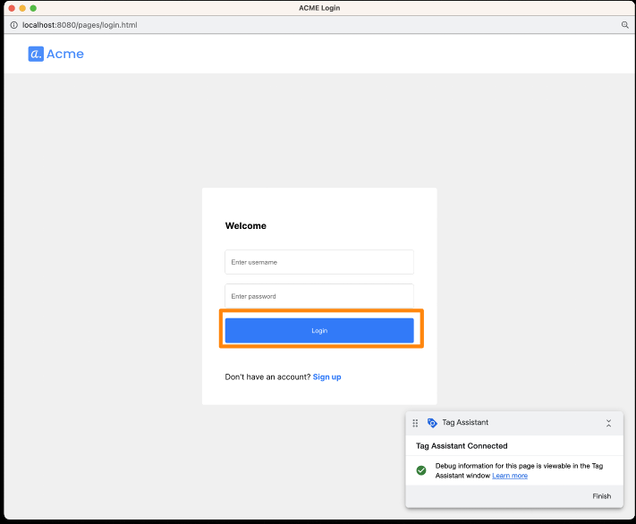

# Detection and Response Service: Google Tag Manager

## はじめに
- 本ドキュメントでは[GTM(Google Tag Manager)](https://developer.transmitsecurity.com/guides/risk/quick_start_gtm/)を用いてDetection and Response Serviceを利用に関する手順を示します
- 仕様や手順に関する詳細は各種ドキュメントを参照してください
  - [About Google Tag Manager](https://developers.google.com/tag-platform/tag-manager)
  - [Tag Manager Help](https://support.google.com/tagmanager)

- 本参考手順は新規にGTMを利用する手順をまとめています。すでにご利用の方は適宜手順をスキップしてください

### 事前準備・前提
- 本ドキュメントでは以下が必要となります
  - インターネットに接続可能な端末
  - ブラウザ
  - 手順に応じた簡易なCLI操作・ファイル編集
- Google Account (TGMの利用のため)
- [Transmit Security Platformでアプリケーションのセットアップ](./setup.md)で適切にアプリケーションの登録を完了していること

## GTMの設定
### アカウント、コンテナの作成
- [Tag Manager](https://tagmanager.google.com/#/home)に接続します
- `Accounts`タブを開き、`Create Account`をクリックします

  

- 以下の内容を入力し、`Create`をクリックします
  - `Account Name`: 適当な名前 (ex: DRS Test)
  - `country`: Japan
  - `Container name`: 適当な名前 (ex: localhost)
  - `Container type`: Web

  

- Terms of Service が表示されますので適宜内容を確認してください
- 正しく作成が完了すると、画面中央にGTMを利用する際に必要となるコードが表示されます。これらの内容をアプリケーションに追加しますのでコピーしてください

    

> **Warning**
> 再度内容を確認しコピーする場合、`Overview`画面上部の`GTM-XXXX`の箇所をクリックし表示内容を確認してください


### GTM 変数の作成
- UserID や クライアントの動作をGTMに通知するため、変数を作成します
- 変数を追加します
  - GTMの左メニュー`Variables`を開き、`User-Defined Variables`の`New`をクリックします
  
    
  
  - 画面上部の変数のタイトルを(ex: `Transmit userID`)を付与します
  - `Variable Configuration`右上のマークをクリックします
  
    
  
  - `Data Layer Varialble`をクリックします
  
    
  
  - `Data Layer Variable Name`に変数名(ex `userID`)を付与し、`Save`をクリックします
  
    

- 上記手順を参考に利用するAction Typeに応じた変数を作成します。作成する変数は利用するもので問題ありません。プリセットのActipn Typeは[Action Types](https://developer.transmitsecurity.com/guides/risk/recommendations/)を参照してください

  

### GTMを使ってDetection and Response Service SDKのロード

- GTMの左メニュー `Tags`を開き、`New`をクリックします

  

- 画面上部のタイトルを(ex: `Initialize Transmit Platform SDK`)を付与します
- `Tag Configuration` 右上のマークをクリックします

  

- `Custom HTML`をクリックします

  

- HTMLの欄にDetection and Response ServiceをInstall , 初期化するためのScriptタグを記述します。以下の内容を修正し、貼り付けてください
  - `[CLIENT_ID]`: Transmit Platformでアプリケーションを作成し取得した値を貼り付けてください
  - `[USER_ID]`: 記録するセッションのUserIDを指定します。今回は動作確認が目的のため固定の文字列`test01`を指定します

  ```javascript
  <script src="https://platform-websdk.transmitsecurity.io/platform-websdk/latest/ts-platform-websdk.js" id="ts-platform-script" defer="true" ></script>
  <script>
    console.log("Start event listener for tsPlatform script");
    window.addEventListener("load", function() {
        console.log("tsPlatform initialize");
        window.tsPlatform.initialize({ 
          clientId: "[CLIENT_ID]", 
          drs: { userId: "[USER_ID]" }, 
        });
    });
  </script>
  ```

- `Triggering`右上のマークをクリックします

  

- `Initialization - All Pages`選択します

  

- `Save`をクリックしてください

### GTMを使ってActionを通知  
- この例ではサンプルアプリケーションの`Login`ボタンをクリックした際に、`login`のイベントが通知されるように設定します

- 先ほどの手順と同様にGTMで`Tag`を作成します

  

- タイトルは`Transmit action`とし、`Tag Configuration` > `Custom HTML`の内容は以下とします

  ```javascript
  <script>
  function saveActionTokenToDataLayer(actionResponse) {
        dataLayer.push({"transmit_action":actionResponse.actionToken});
        console.log('saveActionTokenToDataLayer transmit_action')
  }
  window.tsPlatform.drs.triggerActionEvent("[transmit_action]").then(saveActionTokenToDataLayer);
  </script>
  ```

  - `[transmit_action]`: 割り当てる内容に応じて、先ほど`Variables`で定義したもの中から適当なものを記述します。ここでは`login`と入力します

- `Triggerring`右上のマークをクリックします。

  

- その後、画面右上の`+`クリックし新しいTriggerを作成します

  

- 画面上部のタイトルを(ex: `Transmit send user action`)を付与します。その後、画面右上の`+`クリックし新しいTriggerを作成します

  

- `Trigger Configuration` に先ほど`transmit_action`で指定した`Variables`に対応するAction Typeを記述してください。
- このサンプルでは、ユーザログイン時に`Login`と言うテキストを持つボタンをクリックしますので、その時にAction Typeのイベントが発呼するように設定します

  <p>
    
  </p>
  <p>
    
  </p>
  <p>
    
  </p>
  <p>
    
  </p>

- `Save`をクリックしてください

- 再度、`Save`をクリックしてください

## サンプルアプリケーションの修正、実行
- こちらの手順では[Transmit Security Platform サンプルアプリケーション利用ガイド](https://github.com/hiropo20/ts-ciam-vanilla-sample/blob/main/docs/setup.md#ローカル環境で実行)に従ってサンプルアプリケーションを実行しています。アプリケーションの内容に合わせて適宜変更してください

- GTMを利用するために必要となるファイルの変更を行います
- 以下のコマンドでファイルを開きます

  ```bash
  ## * vi がない場合
  ## apt update && apt install vim -y
  vi /root/ciam-expressjs-vanilla-samples/password-authentication/pages/login.html 
  ```

- `<head>`の直下に[先ほどの手順](./#gtmの設定)で取得した内容を貼り付けます。以下のようなコードです。

  ```html
  <!-- Google Tag Manager -->
  <script>(function(w,d,s,l,i){w[l]=w[l]||[];w[l].push({'gtm.start':
  new Date().getTime(),event:'gtm.js'});var f=d.getElementsByTagName(s)[0],
  j=d.createElement(s),dl=l!='dataLayer'?'&l='+l:'';j.async=true;j.src=
  'https://www.googletagmanager.com/gtm.js?id='+i+dl;f.parentNode.insertBefore(j,  f);
  })(window,document,'script','dataLayer','GTM-xxxxxx');</script>
  <!-- End Google Tag Manager -->
  ```

- `<body>`の直下に[先ほどの手順](./#gtmの設定)で取得した内容を貼り付けます。以下のようなコードです。

  ```html
  <!-- Google Tag Manager (noscript) -->
  <noscript><iframe src="https://www.googletagmanager.com/ns.html?id=GTM-xxxxxx"
  height="0" width="0" style="display:none;visibility:hidden"></iframe></noscript>
  <!-- End Google Tag Manager (noscript) -->
  ```

- 以下のコマンドでアプリケーションを実行します

  ```shell
  SAMPLE=password-authentication yarn start
  ```

## 動作確認
### サンプルアプリケーションの操作
- GTM右上の`Preview`をクリックし、サンプルアプリケーションの状態を確認します

  

- 画面の指示に従って操作します。サンプルでは`http://localhost:8080`をURLとして指定します

  

- 開発コンソールを表示します。画面上で右クリックし、`検証(Inspect)`を選択してください
- `Login`ボタンをクリックしてください。(ユーザ名・パスワードは空白でも問題ありません)

  <p>
    
  </p>

- 正しく動作が確認できた場合、`Console`タブに以下のようなメッセージが表示されます
  1. `Start event listner for tsPlatformscript`: GTMを通じて、`Initialize Transmit Platform SDK` で設定したJavaScriptが正しく実行されたことを示します
  2. `tsPlatform initialize`: HTMLの読み込みが完了した後、SDKの初期化を実行することを示します
  3. `saveActionTokenToDataLayer transmit_action`: ボタンをクリックし、GTMにて読み込まれたイベントが発火し、関数が実行されたことを示します


### Portalの確認

- [Transmit Security portal](https://portal.identity.security/)を開き、左のメニューの`Detection and Response` >  `Recommendations`を開きます
- 設定したUser IDでイベントが記録されていることが確認できます

  


## GTMのリリース
- Preview機能で問題ないことを確認後、Tagの内容をリリースし、本番環境でご利用いただけます。GTMの機能のため本手順で詳細は割愛致します
- `Submit`後、ブラウザに反映されない場合にはキャッシュの削除など行なってください


## Tips: UserIDのハッシュ化

> **warning**
> Transmit Security Platformへ通知するUserIDは、メールアドレスなどの個人情報を含めることを禁止されています

- 本サンプルコードでUserIDをハッシュ化するコードは以下の内容です。サンプルコードを変更し、動作確認をしてください
- GTMの左メニュー `Tags`を開きます。こちらの手順で作成したTag Configuration(ex: `Initialize Transmit Platform SDK`)を開きます
- HTMLの欄に以下の内容を修正し、貼り付けてください
  - `[CLIENT_ID]`: Transmit Platformでアプリケーションを作成し取得した値を貼り付けてください
  - `[USER_ID]`: 記録するセッションのUserIDを指定します。今回は動作確認が目的のため固定の文字列`test01`を指定します

  ```javascript
  <script src="https://platform-websdk.transmitsecurity.io/platform-websdk/latest/ts-platform-websdk.js" id="ts-platform-script" defer="true" ></script>
  <script>
    console.log("Start event listener for tsPlatformscript");
    //// Additional sample function for UserID HASH
    function digestUserid(userid,callback){
      // create SHA256 Digest from userid 
      var encodeUserid = new TextEncoder().encode(userid);
      crypto.subtle.digest("SHA-256",encodeUserid).then(function(useridDigest){
        // Convert Hashed UserID to string
        var tmpArray = [];
        Array.from(new Uint8Array(useridDigest)).forEach(function(b){
          tmpArray.push(b.toString(16).padStart(2, "0"))
        });
        userid = tmpArray.join("");
        callback(userid)
      });
    };
    
    window.addEventListener("load", function() { 
      console.log("document on load");
  
      var userid = "[USER_ID]"
      digestUserid(userid,function(userid){
        console.log("userid:"+userid)
        window.tsPlatform.initialize({ 
          clientId: "[CLIENT_ID]", 
          drs: { userId: userid }, 
        });
      });
    });
  </script>
  ```

## Tips: 任意のタイミングでUserIDのセット
- [GTMを使ってDetection and Response Service SDKのロード](./drs-gtm.md#gtmを使ってdrs-sdkのロード)で示したサンプルは、SDKのInitializeと同時にUserIDを指定するコードとなります
- UserIDはInitializeとは別の任意のタイミングで指定することも可能です
- 以下は、本手順で示したサンプルアプリケーションの`Username欄に文字列が入力され、そのinput欄からカーソルが外れた場合にUserIDをセットする`サンプルコードとなります
- GTMの左メニュー `Tags`を開きます。こちらの手順で作成したTag Configuration(ex: `Initialize Transmit Platform SDK`)を開き、`スクリプトタグ内(</script>の直上)`に貼り付けてください

```javascript
  document.getElementById("username").addEventListener("change",function(){
    console.log(this.value);
    window.tsPlatform.drs.setAuthenticatedUser(this.value)
  })
```

- 上記のように個別でUserIDを指定される場合
  - 初期化(initialize)でUserIDの指定は必須ではありません。コメントアウトまたは削除いただいて問題ありません
  - 初期化(initialize)でUserIDを指定済みの場合、上記コードの実行によりUserIDが上書きされます

```javascript
  // ** 該当箇所の抜粋 **
  window.addEventListener("load", function() {
      console.log("tsPlatform initialize");
      window.tsPlatform.initialize({ 
        clientId: "[CLIENT_ID]", 
        // drs: { userId: "[USER_ID]" }, << こちらをコメントアウト・削除いただいてもInitializeは正常に完了します

      });
  });

```


## 参考情報
- [Transmit Security GTM(Google Tag Manager)](https://developer.transmitsecurity.com/guides/risk/quick_start_gtm/)
- [Transmit Security JavaScript SDK drs](https://developer.transmitsecurity.com/sdk-ref/platform/modules/drs/)
- [About Google Tag Manager](https://developers.google.com/tag-platform/tag-manager)
- [Tag Manager Help](https://support.google.com/tagmanager)
- [Integrate using Google Tag Manager](https://developer.transmitsecurity.com/guides/risk/quick_start_gtm/)