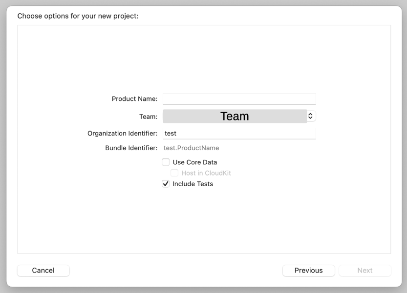

# Detection and Response Service: iOS SDK

## はじめに
- 本ドキュメントでは[iOS SDK](https://developer.transmitsecurity.com/guides/risk/quick_start_ios/)でDetection and Response Serviceを利用する手順を示します
- 本ドキュメントでは、以下環境を利用した実装サンプルを示しています。利用言語や環境に合わせて進めてください
  - Xcode Version 14.3.1
  - その他利用言語の情報
    - Swift, SwiftUI

> **warning**
> 本手順は2023/09/08時点の参考手順となります。
> iOSの実装方法や、Xcode機能は変更されることがありますので、適宜最新の情報を確認してください
> また、その変更に合わせて TransmitSecurityの[iOS SDK quick start](https://developer.transmitsecurity.com/guides/risk/quick_start_ios/)内容も変更になる場合があります。合わせてご確認ください

### 事前準備・前提
- 本ドキュメントでは以下が必要となります
  - インターネットに接続可能な端末
  - 手順に応じた簡易なCLI操作・ファイル編集
- Xcode
- [Transmit Security Platformでアプリケーションのセットアップ](./setup.md)で適切にアプリケーションの登録を完了していること

## iOS Sample Applicationのデプロイ
### サンプルアプリケーションの実行
- はじめにXcodeを利用したサンプルアプリケーションのデプロイ手順を確認します
- Xcodeを起動し、`New Project`を開きます
  - Welcome画面より選択される場合、`Create a new Xcode project`を選択してください
  - メニューから選択される場合、`File` > `New` > `Project` を選択してください
- Templateから`App`をクリックします

  

- 適宜必要な情報を入力してください。以下が入力例となります
  - `Product Name`: app1
  - `Team`: **利用するApple Account**
  - `Organization Identifier`: test

  

### iOS サンプルアプリケーションの動作確認
- 画面上部より、アプリケーションの実行環境として`iPhone`を選択します。こちらの例では`iPhone14`を選択します

  

- 画面右側にサンプルアプリケーションのプレビューが右側に表示されます

  

- 画面左上、`▶️`ボタンをクリックし、アプリケーションをEmulateした端末上で実行します。先ほどのプレビューと同様の内容が表示されます。

  

- 画面にはアプリが実行され`Hello World!`の文字が表示されていることがわかります

  

- XCode左上のメニューの`◼️`ボタンをクリックし、動作を停止させます

  

## Detection and Response Service iOS SDK の読み込み

### Detection and Response Service iOS SDK の読み込み

- Detection and Response Service iOS SDKを読み込むため以下の操作を行います
- メニュー左上`app1`を選択し、画面右側 PROJECTの下`app1`、`Package Dependencies`のタブを開き、`+`ボタンをクリックします

  

- 右上の検索欄に、[https://github.com/TransmitSecurity/accountprotection-ios-sdk.git](https://github.com/TransmitSecurity/accountprotection-ios-sdk.git)を入力し、Dependency Ruleに`2.0.0`と入力し、右下の`Add Package`をクリックします

  

- パッケージが正しく追加されたことが確認できます

  

### ContentViewModelファイルの作成

- `app1`のフォルダを右クリックし`New File`をクリックします。

  

- `Swift File`を選択し、`Next`をクリックします

  

- Save As に `ContentViewModel.swift` を入力し、`Create`をクリックします

  

- 生成したファイルに以下の内容を追記します

  ```swift
  import SwiftUI
  import AccountProtection
  
  
  class ContentViewModel: ObservableObject {
      @Published var userId: String = ""
      @Published var actionSelection = "login"
      @Published var showAlert = false
      @Published var alertTitle = ""
      @Published var alertMessage = ""
  
     let actionTypes = ["login", "register", "transaction", "password_reset",   "logout", "checkout", "account_details_change", "account_auth_change",   "withdraw", "credits_change"]
      
      func setUserId() {
          guard !userId.isEmpty else {
              setAlert(title: "Error", message: "User id field is empty")
              return
          }
          debugPrint("userId:　\(userId)")
          TSAccountProtection.setUserId(userId)
      }
      
      func clearUser() {
          TSAccountProtection.clearUser()
          userId = ""
      }
      
      func reportAction() {
          TSAccountProtection.triggerAction(actionSelection) { result in
  
              DispatchQueue.main.async {
                  switch result {
                  case .success(let response):
                      debugPrint("token: \(response.actionToken)")
                      self.setAlert(title: "Action: \(self.actionSelection) was   successfully sent to server", message: "token: \(response.  actionToken)")
                  case .failure(let error):
                      debugPrint(error.localizedDescription)
                      let errorMessage: String
                      switch error {
                      case .disabled:
                          errorMessage = "Action is Disabled"
                      case .connectionError:
                          errorMessage = "Connection Error"
                      case .internalError:
                          errorMessage = "Internal Error"
                      case .notSupportedActionError:
                          errorMessage = "Action: \(self.actionSelection) IS NOT   SUPPORTED"
                      @unknown default:
                          errorMessage = "Unknown Error"
                      }
                      self.setAlert(title: "Error was encountered", message:   errorMessage)
                  }
              }
          }
      }
      
      private func setAlert(title: String, message: String) {
          alertTitle = title
          alertMessage = message
          showAlert = true
      }
  
  }
  ```

### ContentViewファイルの変更

- 以下の内容を貼り付けます。このサンプルでは`ContentView.swift`に貼り付けます

  ```swift
  import SwiftUI
  import AccountProtection
  
  struct ContentView: View {
      @ObservedObject var viewModel: ContentViewModel
  
      var body: some View {
          VStack{
              Text("Set / Unset User ID:")
              TextField("UserID", text: $viewModel.userId)
                  .textFieldStyle(.roundedBorder)
              HStack {
                  Button("setuser"){
                      viewModel.setUserId()
                  }.buttonStyle(.bordered)
                  Button("unsetuser"){
                      viewModel.clearUser()
                  }.buttonStyle(.bordered)
              }
              Text("Select action event:")
                  Picker("Select action event", selection: $viewModel.  actionSelection) {
                      ForEach(viewModel.actionTypes, id: \.self) {
                                      Text($0)
                                  }
                              }
                  .pickerStyle(.menu)
                  .tint(Color.gray)
              Button("sendaction"){
                  viewModel.reportAction()
              }.buttonStyle(.bordered)
              Spacer()
          }
          .padding([.leading, .trailing], 16)
          .background(Color.white)
          .alert(isPresented: $viewModel.showAlert, content: {
              Alert(title: Text(viewModel.alertTitle),
                    message: Text(viewModel.alertMessage),
                        dismissButton: .default(Text("OK")) {})
              })
          
      }
  }
  
  struct ContentView_Previews: PreviewProvider {
      static var previews: some View {
          ContentView(viewModel: ContentViewModel())
      }
  } 
  ```

### エントリーポイントの変更

- 以下の内容を貼り付けます。このサンプルでは`app1App.swift`に貼り付けます
  - `[CLIENT_ID]`: Transmit Platformでアプリケーションを作成し取得した値を貼り付けてください

  ```swift
  mport SwiftUI
  mport AccountProtection
  
  main
  truct app01App: App {
  
     init() {
         TSAccountProtection.initialize(clientId: "[CLIENT_ID]")
     }
     
     var body: some Scene {
         WindowGroup {
             ContentView(viewModel: ContentViewModel())
         }
     }
  ```

## SDKをデプロイしたiOSアプリケーションの動作確認
### iOSサンプルアプリケーションの動作確認

- `ContentView.swift`を開くと、画面右側にサンプルアプリケーションのプレビューが右側に表示されます

  

- 画面左上、`▶️`ボタンをクリックし、アプリケーションをEmulateした端末上で実行します。先ほどのプレビューと同様の内容が表示されます。

  


### iOSアプリケーションの操作

- 画面上部が`UserのSet / Unset`、下部が`ユーザとして通知するAction`となります
- 以下の順序でボタンをクリックした結果を確認します

- Set User
  1. UserIDの欄に`TEST01`と入力します
  1. `setuser`をクリック
  1. プルダウンから`register`を選択し、`sendaction`をクリックし、ポップアップの`OK`をクリックして閉じます
  1. プルダウンから`transaction`を選択し、`sendaction`をクリック、ポップアップの`OK`をクリックして閉じます

  

- Unset User
  1. `unsetuser`をクリック
  1. プルダウンから`register`を選択し、`sendaction`をクリックし、ポップアップの`OK`をクリックして閉じます
  1. プルダウンから`transaction`を選択し、`sendaction`をクリック、ポップアップの`OK`をクリックして閉じます

  

- `Set User`の`register`について詳細を確認します

  <p></p>

  <p></p>

- JSON右上のボタンをクリックすることにより、JSONの内容をコピーすることが可能です

### iOSアプリケーションのログの確認

- 動作するアプリケーションのログを確認することが可能です
- メニュー`View` > `Debug Area` > `Activate Console`を選択いただくか、画面下部のDebug Areaを表示するボタンをクリックしてください

  


## Tips: UserIDのハッシュ化

> **warning**
> Transmit Security Platformへ通知するUserIDは、メールアドレスなどの個人情報を含めることを禁止されています

- 本サンプルコードでUserIDをハッシュ化するコードは以下の内容です。サンプルコードを変更し、動作確認をしてください

- `CryptoKit`をImportします
  
  ```diff
    import SwiftUI
    import AccountProtection
  + import CryptoKit
  ```

- `setUserId`の関数を以下の内容に変更します

  ```diff
  func setUserId() {
      guard !userId.isEmpty else {
          setAlert(title: "Error", message: "User id field is empty")
          return
      }
  -   debugPrint("userId:　\(userId)")
  -   TSAccountProtection.setUserId(userId)
  +   let data = Data(userId.utf8)
  +   let hashed = SHA256.hash(data: data)
  +   let hasedId = hashed.compactMap { String(format: "%02x", $0) }.joined()
  +   debugPrint("userId:　\(hasedId)")
  +   TSAccountProtection.setUserId(hasedId)
  }   
  ```

## 参考情報

- [Transmit Security iOS SDK quick start](https://developer.transmitsecurity.com/guides/risk/quick_start_ios/)
- [Transmit Security iOS SDK](https://transmitsecurity.github.io/accountprotection-ios-sdk-docs/documentation/accountprotection/)
- [transmit-iOS-samples](https://github.com/TransmitSecurity/transmit-iOS-samples)

