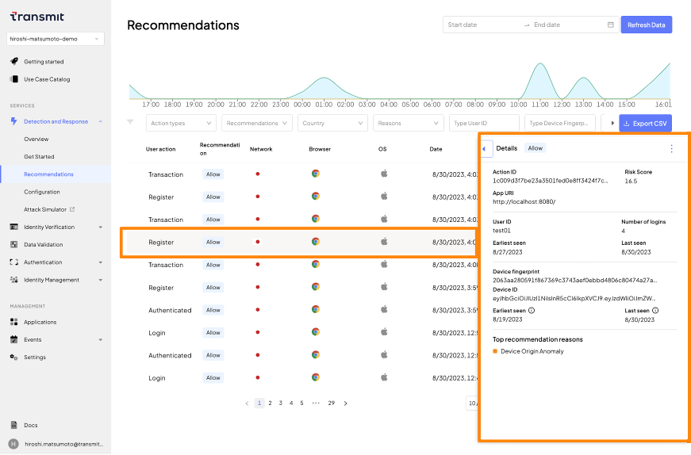

# Detection and Response Service: JavaScript SDK

## はじめに
- 本ドキュメントでは[JavaScript SDK](https://developer.transmitsecurity.com/guides/risk/quick_start_web/)を用いてDetection and Response Serviceを利用する手順を示します
- サンプルアプリケーションをローカル環境で実行した手順を示しています。試される環境に合わせて適宜アクセスするURLなど変更して操作ください

### 事前準備・前提
- 本ドキュメントでは以下が必要となります
  - インターネットに接続可能な端末
  - ブラウザ
  - 手順に応じた簡易なCLI操作・ファイル編集
- [Transmit Security Platformでアプリケーションのセットアップ](./setup.md)で適切にアプリケーションの登録を完了していること

## Webサーバの実行
- JavaScript SDKを利用するためWebサーバ(nginx)を実行します

  ```shell
  docker run --platform linux/amd64 -p 8080:80 -it nginx /bin/bash
  ```

## HTMLファイルの編集

- 対象のHTMLファイルを変更します

  ```
  ## * vi がない場合
  ## apt update && apt install vim -y
  vi /usr/share/nginx/html/index.html
  ```

- `<head>`の直下に以下の内容を貼り付けます
  - `[CLIENT_ID]`: Transmit Platformでアプリケーションを作成し取得した値を貼り付けてください
  - `[USER_ID]`: 記録するセッションのUserIDを指定します。今回は動作確認が目的のため固定の文字列`test01`を指定します

  ```javascript
  <script src="https://platform-websdk.transmitsecurity.io/platform-websdk/latest/ts-platform-websdk.js"   id="ts-platform-script" defer="true" ></script>
  <script>
    // SDK Initialize
    console.log("Start event listener for tsPlatform script");
    window.addEventListener("load", function() {
        console.log("tsPlatform initialize");
        window.tsPlatform.initialize({ 
          clientId: "[CLIENT_ID]"
        });
    });
  </script>
  
  <script>
    // SDK Set User
    async function setDRSUser() {
      let userid = "[USER_ID]"
      window.tsPlatform.drs.setAuthenticatedUser(userid);
      console.log("setAuthenticationUser")
    }
    // SDK reportAction
    async function reportAction(actionType) {
      window.tsPlatform.drs.triggerActionEvent(actionType).then((actionResponse) => {
        let actionToken = actionResponse.actionToken;
        console.log("Action Type:"+actionType+",Token:"+actionToken)
      });
    }
    // SDK Clear User
    async function unsetDRSUser() {
      window.tsPlatform.drs.clearUser()
      console.log("clearUser")
    }
  </script>
  ```


- `<body>`タグの末尾、`</body>`の直上に以下の内容を貼り付けます

  ```html
  <!-- Set/Unset User-->
  <p>
    <h4>Set/Unset User</h4>
    <button class="btn" style="margin:5px;" onclick="setDRSUser()">Set User</button>
    <button class="btn" style="margin:5px;" onclick="unsetDRSUser()">Unset User</button>
  </p>
  <!-- Report Action -->
  <p>
    <h4>Report Action Button</h4>
    <button class="btn" style="margin:5px;" onclick="reportAction('register')">register</button>
    <button class="btn" style="margin:5px;" onclick="reportAction('transaction')">transaction</button>
    <button class="btn" style="margin:5px;" onclick="reportAction('checkout')">checkout</button>
    <button class="btn" style="margin:5px;" onclick="reportAction('password_reset')">password_reset</button>
    <button class="btn" style="margin:5px;" onclick="reportAction('logout')">logout</button>
    <button class="btn" style="margin:5px;" onclick="reportAction('account_details_change')">account_details_change</button>
    <button class="btn" style="margin:5px;" onclick="reportAction('account_auth_change')">account_auth_change</button>
    <button class="btn" style="margin:5px;" onclick="reportAction('withdraw')">withdraw</button>
    <button class="btn" style="margin:5px;" onclick="reportAction('credits_change')">credits_change</button>
  </p>
  ```

- NGINXを実行します。すでにNGINXが起動している場合には次の動作確認に進んで問題ありません

  ```
  service nginx start
  ```

## 動作確認

- ブラウザでサンプルアプリケーション([http://localhost:8080](http://localhost:8080))に接続します

  

- 適宜ボタンをクリックします
- 以下の順序でボタンをクリックした結果を確認します

- Set User
  1. `Set User`
  1. `register`
  1. `transaction`

  

- Unset User
  1. `Unset User`
  1. `register`
  1. `transaction`

  

## Tips: UserIDのハッシュ化

> **warning**
> Transmit Security Platformへ通知するUserIDは、メールアドレスなどの個人情報を含めることを禁止されています

- 以下のJavaScriptのコードを、`setDRSUser`内の`let userid...`から`window.tsPlatform.drs.setAuthenticatedUser...`の間に貼り付けてください

  ```javascript
  //// Additional JavaScript for UserID HASH
  // create SHA256 Digest from userid 
  let encodeUserid = new TextEncoder().encode(userid)
  const useridDigest = await crypto.subtle.digest("SHA-256",encodeUserid)
  // Convert Hashed UserID to string
  userid = Array.from(new Uint8Array(useridDigest))
  .map((b) => b.toString(16).padStart(2, "0"))
  .join("");
  console.log(userid);
  ```


## 参考情報
- [Transmit Security JavaScript SDK quick start](https://developer.transmitsecurity.com/guides/risk/quick_start_web/)
- [Transmit Security JavaScript SDK drs](https://developer.transmitsecurity.com/sdk-ref/platform/modules/drs/)