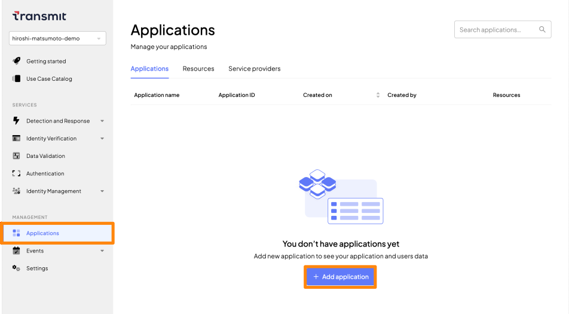
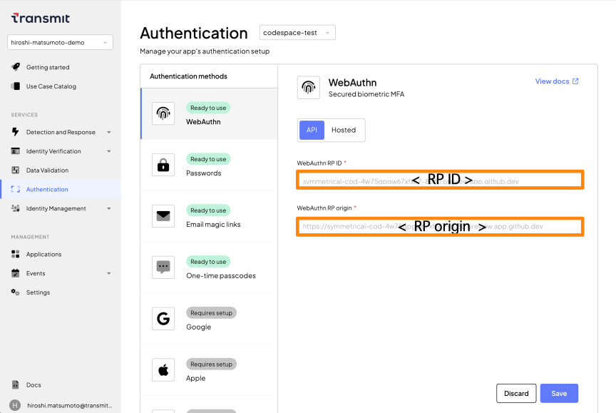
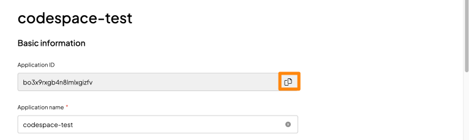
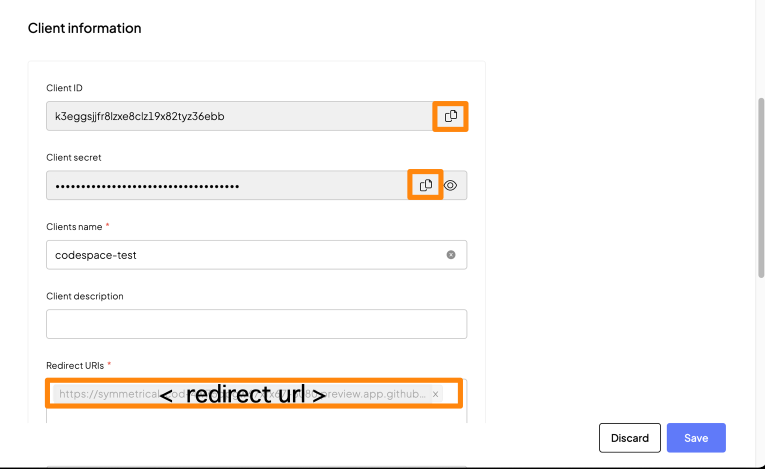

# 事前作業

## はじめに
- 本ドキュメントではアプリケーションの登録作業の手順を示します
- Transmit Security Platformと連携するアプリケーションの`Redirect URI`が必要となりますのであらかじめご確認ください

### 1.Transmit Security Platform にアプリケーションの登録

- [Transmit Security portal](https://portal.identity.security/)にアクセスし、ログインします
- Applicationを作成します。左のメニューより`Applications`を開き、`+Add applications`をクリックします

  

- 以下のパラメータを参考に設定します
  - `Application name`: codespace-test
  - `Public sign-up`: Allow registration を選択
  - `Client name`: codespace-test
  - `Redirect URI` : 利用するアプリケーションのRedirect URI。[CIAMサンプルアプリケーション](https://github.com/TransmitSecurity/ciam-expressjs-vanilla-samples.git)の場合、`<http or https://<アプリケーションのFQDN>/complete`を指定します
- 画面最下部`Add`をクリックし、Applicationの作成を完了します

### 2.Transmit Security Platform にアプリケーションの設定追加
- [Transmit Security portal](https://portal.identity.security/)を開き、左のメニューより`Applications`を開きます
- 画面上部のメニューより先ほど作成したアプリケーションを開きます

  

- `Authentication methods`の欄から`WebAuthn`を選択します
  - `WebAuthn RP origin` : `Redirect URI`で指定したURI情報からPATHを削除した文字列
  - `WebAuthn RP ID` : `WebAuthn RP origin`で指定した文字列の`FQDN`部分
- `Save`をクリックします

### 3.アプリケーションの設定情報の取得
- アプリケーションはTransmit Security Platformと適切に通信を行うため、各種パラメータを利用します。以下の内容を参考に適宜値を取得してください
- [Transmit Security portal](https://portal.identity.security/)を開き、左のメニューより`Applications`を開きます
- 先ほど作成したアプリケーションを開きます。以下の内容を参考に、`Application ID`、`Client ID`、`Client Secret`の値を各パラメータの値を参照してください

  

  

  