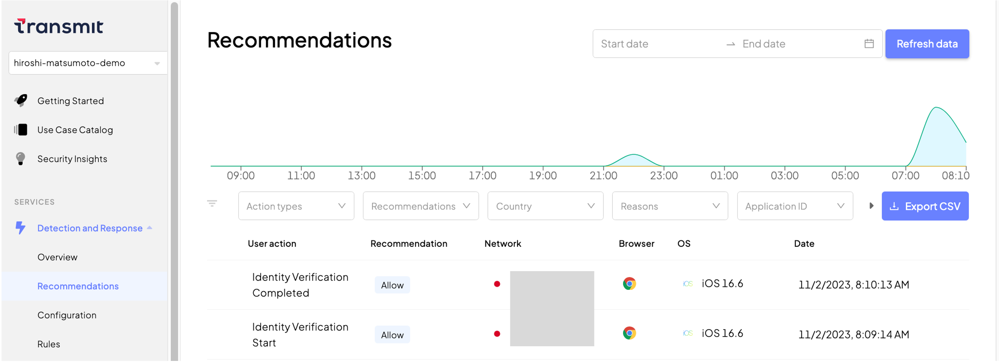

# Hosted IDV(ID Verification)

## 対象サンプルアプリケーション
- [hosted-idv](https://github.com/TransmitSecurity/ciam-expressjs-vanilla-samples/tree/main/hosted-idv)
## 処理フロー

### ログイン時の処理フロー

こちらのログインフローは、デスクトップにてブラウザ(Client)で操作を開始する想定となります。
IDVはアカウントの生成などは行わず、以下のフローに従って利用をする人が正しいかどうかを評価します。


- 5の応答結果として以下のような値が応答されます
  ```json
  {
    // Use the start token to start the verification on the client side
    "start_token": "abcd6ed78c8c0b7824dfea356ed30b72",
    "session_id": "EXAMPLEskjzsdhskj4",
    "expiration": "2023-12-27T11:59:07.420Z",
    // Array of images to capture
    "missing_images": [
        "document_front",
        "document_back",
        "selfie"
    ]
  }
  ```

- 6で生成するURLは5のstart_tokenを利用します
- 9は5のsession_idをURLパラメータとして渡します
- 11でsession_idを利用してAPIに接続します


### 利用するTransmit SecurityのAPI

  | STEP | 役割 | API | 
  | --- | --- | --- |
  |4,10|APIに利用するAccessTokenの取得|[Get client access token](https://developer.transmitsecurity.com/openapi/token/#operation/getAccessToken)|
  |5|IDVセッションの作成|[Create verification session](https://developer.transmitsecurity.com/openapi/verify/verifications/#operation/createSession)|
  |11|IDVの結果取得|[Get verification result](https://developer.transmitsecurity.com/openapi/verify/verifications/#operation/getResult)|


## はじめに
- 本ドキュメントではサンプルアプリケーションの利用に関する手順を示します
- サンプルアプリケーションを[ローカル環境で実行](./setup.md#ローカル環境で実行)した際の手順を示しています。試される環境に合わせて適宜アクセスするURLなど変更して操作ください

### 事前準備・前提
- 本ドキュメントでは以下が必要となります
  - インターネットに接続可能な端末
  - ブラウザ
  - 送受信可能なメールアドレス
  - 手順に応じた簡易なCLI操作・ファイル編集
- 各国でサポートされているドキュメントの情報は[Supported documents](https://developer.transmitsecurity.com/guides/verify/global_coverage/)を参照してください


## サンプルアプリケーションの実行
```
SAMPLE=hosted-idv yarn start
```

## 動作確認

### アプリケーション利用手順

- ブラウザでサンプルアプリケーション([http://localhost:8080](http://localhost:8080))に接続

#### IDVの実施
- アプリケーションの画面に表示されたボタンをクリック

  

- IDVを開始するため、QRコード・URLが表示されます。モバイル端末で情報を読み取り、IDVのセッションを開始します

  

- モバイル端末で指示に従って操作を行います。このサンプルでは`パスポート`を利用しIDVを実施しています。IDVではカメラを利用しますので、適切な手順で端末・ブラウザでカメラの利用を許可してください

  - IDVを開始します

  <p></p>

  - パスポートの写真が記載されているページの情報を読み取ります

  <p></p>

  - セルフィー（インカメラによる顔写真）を撮影します

  <p></p>

  - 正しい情報であるか評価します。一定時間経過後、結果が画面に表示されます

  <p></p>

  <p></p>


- 上記のモバイル端末での操作が完了すると、自動的にデスクトップのブラウザに評価結果が表示されます

  

#### Portalの確認

- Identitiy Verifification > Verifications に評価結果が表示されます

  

- こちらはStatusでフィルタされています。フィルタは以下の中からStatusを選択できます

  

- エントリをクリックすると、評価の詳細を確認できます

  

- RiskScoreをクリックすると、Recommendationsを開き、IDV評価がどのように判定されたか詳細を確認することが可能です

  <p></p>

  - 対象となるエントリをクリックさらに情報の閲覧が可能です

  <p></p>

  - 対象エントリ右上の「:」をクリックし、Raw Dataを選択することで、IDVの詳細や判定に関する情報を確認できます

  <p></p>


<!--
### Developer Portal ステータス

> **Warning**
> Portalの機能、画面のデザインは日々アップデートされます。本ページの画像は参考情報としてご確認ください

## デバッグ
-->

## 参考情報
- [Web hosted IDV](https://developer.transmitsecurity.com/guides/verify/quick_start_web/)