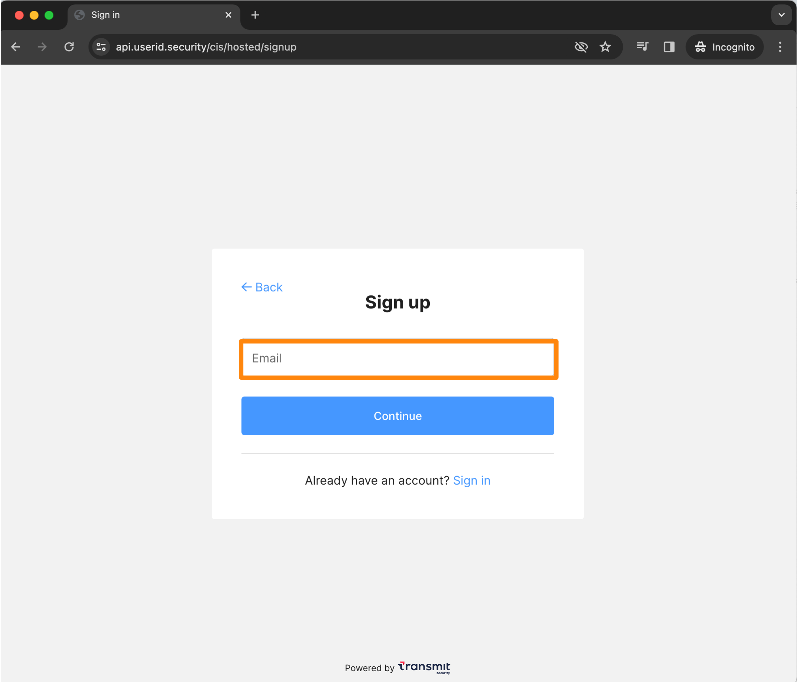
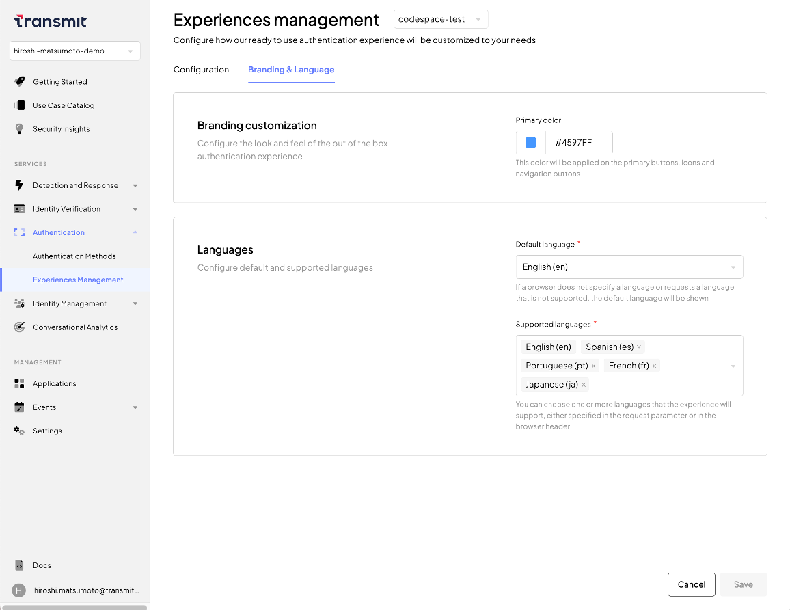
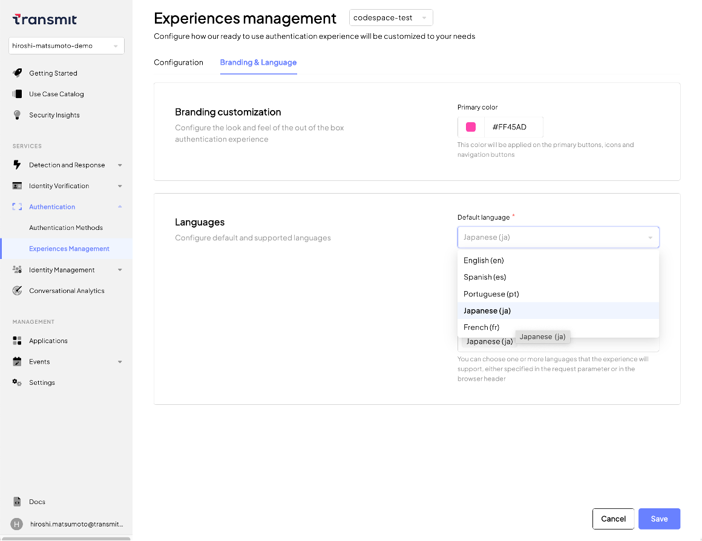
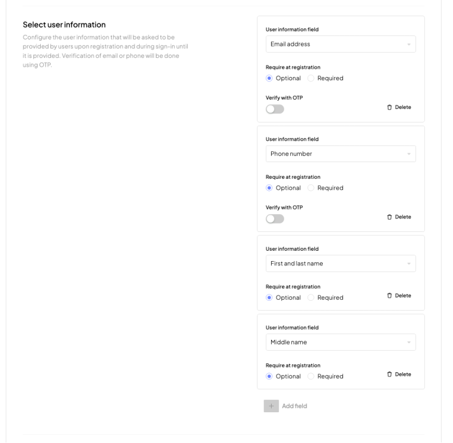
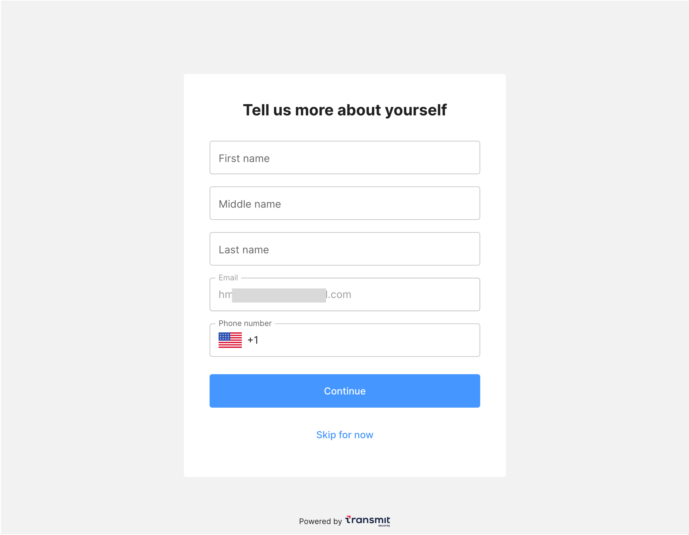

# Hosted Login

## 対象サンプルアプリケーション

- パスワード認証のサンプルアプリケーションの一部を変更し、`hosted-login`の動作を確認いたします

> [!NOTE]
> 本手順は2023/12/26時点でHosted Loginを利用するためのサンプル手順を示しています
> 別途、該当するサンプルアプリケーションがリリースされましたらそちらを利用してください

## はじめに
- 本ドキュメントではサンプルアプリケーションの利用に関する手順を示します
- サンプルアプリケーションを[ローカル環境で実行](./setup.md#ローカル環境で実行)した際の手順を示しています。試される環境に合わせて適宜アクセスするURLなど変更して操作ください

### 事前準備・前提
- 本ドキュメントでは以下が必要となります
  - インターネットに接続可能な端末
  - ブラウザ
  - 手順に応じた簡易なCLI操作・ファイル編集

## hosted-loginを利用するため一部実装の変更

- Hosted Loginを利用するため、以下の手順にしたがって環境をセットアップしてください

### ファイルのコピー

```
cp -r ~/ciam-expressjs-vanilla-samples/password-authentication ~/ciam-expressjs-vanilla-samples/hosted-login
cd ~/ciam-expressjs-vanilla-samples/
```

### ファイルの修正

- HTMLファイルの修正。`hosted-login/pages`配下の`login.html`を修正してください


```
## * vi がない場合
## apt update && apt install vim -y
vim ~/ciam-expressjs-vanilla-samples/hosted-login/pages/login.html
```

- script タグ内にJavaScriptの関数を追加します。 </head>上の</script>の直前に以下を追加してください。

```html
      async function hostedlogin() {
        // We create a claim to get the username in the ID Token
        const claims = JSON.stringify({
          id_token: {
            username: null,
          },
        });

        // Here we configure the authentication request parameters
        // See: https://developer.transmitsecurity.com/openapi/user/oidc/#operation/oidcAuthenticate
        const queryParams = new URLSearchParams({
          client_id: window.env.VITE_TS_CLIENT_ID,
          redirect_uri: window.env.VITE_TS_REDIRECT_URI,
          scope: 'openid',
          response_type: 'code',
          prompt: 'consent'
        });
        console.log("URL Param:" + queryParams)

        const url = `${
          window.env.VITE_TS_API_BASE ||
          'https://api.userid.security' /*'https://api.transmitsecurity.io'*/
        }/oidc/auth?${queryParams.toString()}`;

        // Request centralized login from the authentication hub
        // See: https://developer.transmitsecurity.com/guides/user/authentication_hub/#3-request-centralized-login
        window.location.replace(url);
      
      }
```

- HTML main 内に先ほど追加した関数を実行するHTMLを追加します。 </main>上の</div>の上に以下を追加してください

```html
          <button class="full-width" onclick="hostedlogin()">Hosted Login</button>
```


### .envの修正

- `.envファイル`の修正

```
## * vi がない場合
## apt update && apt install vim -y
vim ~/ciam-expressjs-vanilla-samples/.env
```

- 以下の内容を参考に変数を追加してください。ドメイン、ポートの内容は実行するサンプルアプリケーションを実行する環境に合わせて修正してください

```
## 末尾にVITE_TS_REDIRECT_URIを追加
## TS_REDIRECT_URIの内容をコピーし、変数名の先頭に`VITE_`を付与すれば良い
VITE_TS_REDIRECT_URI=http://localhost:8080/complete
```

## サンプルアプリケーションの実行
```
## cd ~/ciam-expressjs-vanilla-samples/
SAMPLE=hosted-login yarn start
```

## 動作確認

### アプリケーション利用手順

#### 初回接続時：アカウントの登録

- ブラウザでサンプルアプリケーション([http://localhost:8080](http://localhost:8080))に接続します

- アプリケーション下部の`Hosted Login`をクリックしてください (HTML変更により追加したボタン)

  

- ボタンのクリックにより、`Hosted Loginの画面`へ遷移します。URLがサンプルアプリケーションから変わっていることを確認してください
- アカウント登録のため、アプリケーション下部の`Sign up`をクリックしてください

  

- `Email`欄に有効なEメールアドレスを入力してください

- 作成するアカウントの`username`、`passsword`を入力し、`Sign up`をクリックしてください

  

- 入力したメールアドレスに対し、OTPが送付されます。有効なメールアドレスの内容を確認し、画面に入力します

  <p></p>

  <p></p>

- 正しくOTPが入力できると、Passkeyの登録メニューが表示されます。`Register passkey`をクリックします

  

- 画面の表示に従ってPasskeyの登録を行います

  <p></p>

  <p></p>

- パスワードの入力画面が表示されます。画面の表示に従って登録を行います。こちらのテスト実行では以下の内容を入力しています
  - `Password` : TestP@ssw0rd

  <p></p>

- パスワードの入力ポリシーがポップアップで画面に表示されます

  <p></p>

  <p></p>

- ログイン登録が正しく完了すると、ユーザ情報の入力画面が表示されます。入力をスキップするため`Skip for now`をクリックします

  

- 登録作業が正しく完了します

  

- 画面右上のログアウトボタンより一度ログアウトします

#### ログイン成功の操作

- アプリケーション下部の`Hosted Login`をクリックしてください (HTML変更により追加したボタン)

  

- ボタンのクリックにより、`Hosted Loginの画面`へ遷移します。Email入力欄をクリックし`Continue`と、登録したPasskeyの選択画面が表示されます

  

- 登録したPasskeyを利用してログインします

  

- ユーザ情報の入力が面が表示されます。入力をスキップするため`Skip for now`をクリックします

  

- ログインが正しく完了します

  

- ログアウトボタンより一度ログアウトします

#### Hosted Login画面の設定変更

- PortalよりHosted Login画面のデザインや動作を変更することが可能です。Portalの左のメニューの`Authentication` > `Experiences Management`を開きます

  

- 画面デザインを変更します。画面上部`Branding & Language`を開きます

  <p></p>

  - `Branding customization` : 画面の配色を設定します

    <p></p>

  - `Language` : 利用する言語を選択します。こちらのサンプルでは`japanese(ja)`を選択します

    <p></p>

- アプリケーション下部の`Hosted Login`をクリックしてます。日本語(機械翻訳)の表示、また指定した色のデザインとなります。以下に参考の画面を示します

    <p></p>

    <p></p>

### 参考: `Experiences Management`の変更

- Portalの左のメニューの`Authentication` > `Experiences Management`を開きます。主要な設定項目について示します

  

#### 提供するログイン方法の指定
- メニュー： `Select authentication methods` > `Primary authentication method`、`Secondary authentication methods` 

  

- 動作のサンプルを示します

  - Hosted Loginの画面を開きます。Email欄にメールアドレスを入力し、`Continue`をクリックします

  <p></p>

  - `Primary authentication method`で指定した手法のログイン画面が表示されます

  <p></p>

  - 画面下部の`Use another method`をクリックします。`Secondary authentication methods`で有効となるログイン手法が一覧で表示されます

  <p></p>

#### ユーザ登録を受け付ける項目の指定

- メニュー：　`Select user information`

  

- 動作のサンプルを示します

  <p></p>


<!--
## デバッグ
-->

## 参考情報
- [Hosted login](https://developer.transmitsecurity.com/guides/user/hosted_login_how_it_works/)


