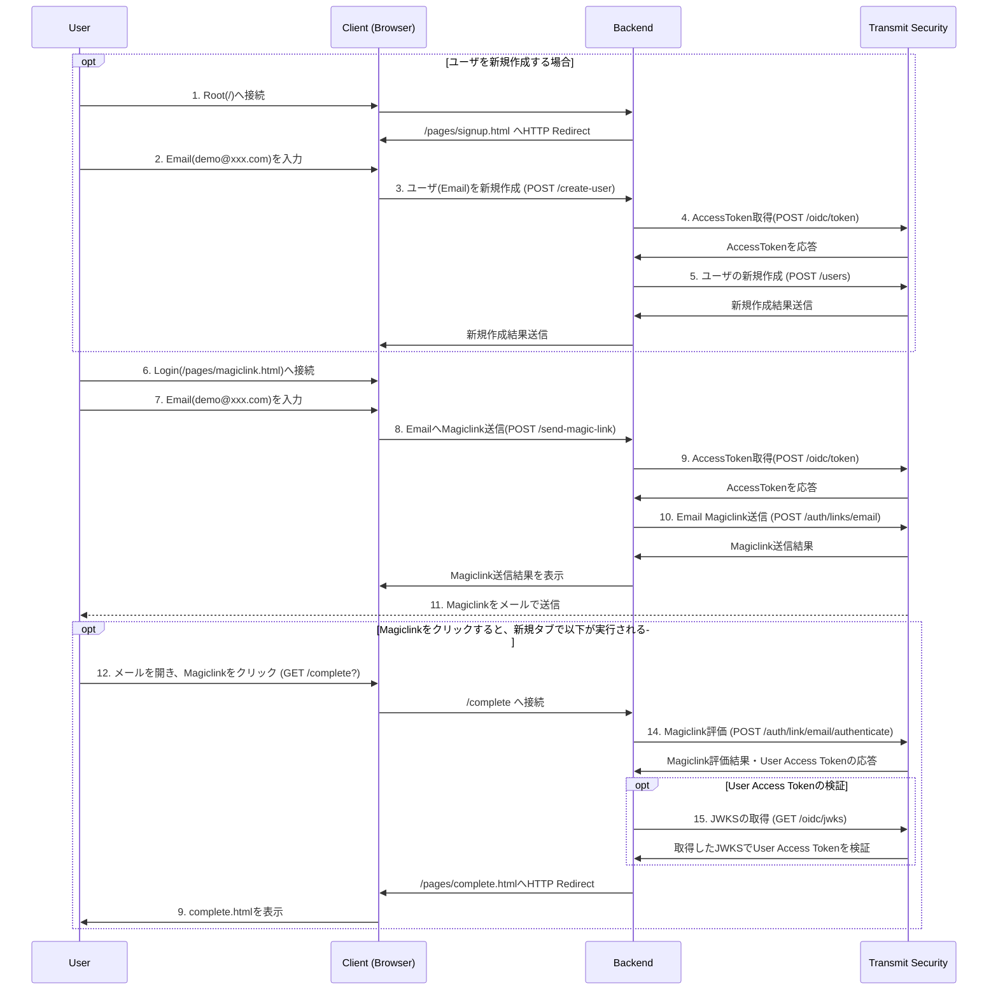
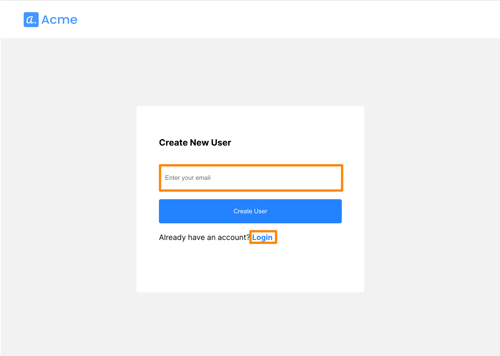
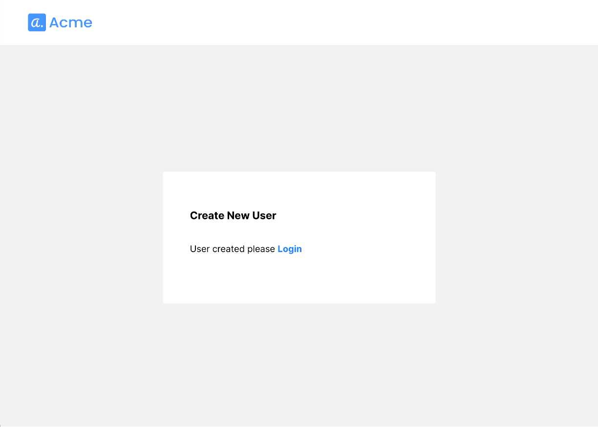
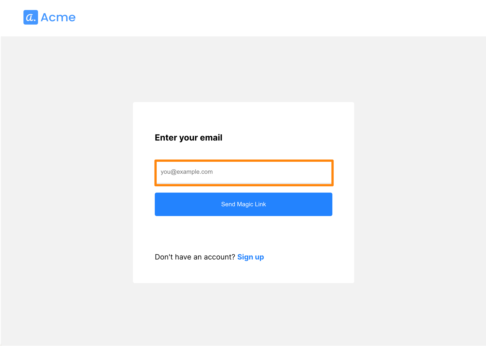
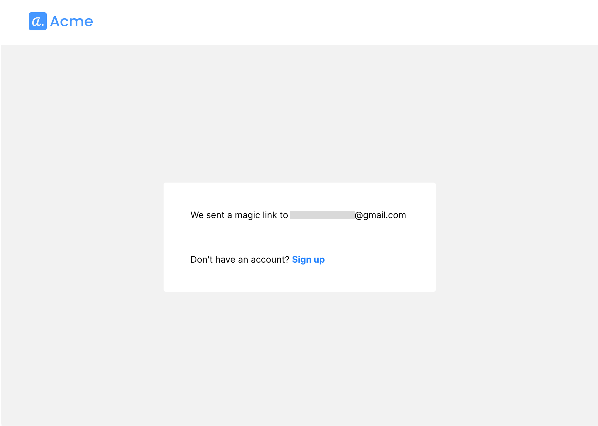
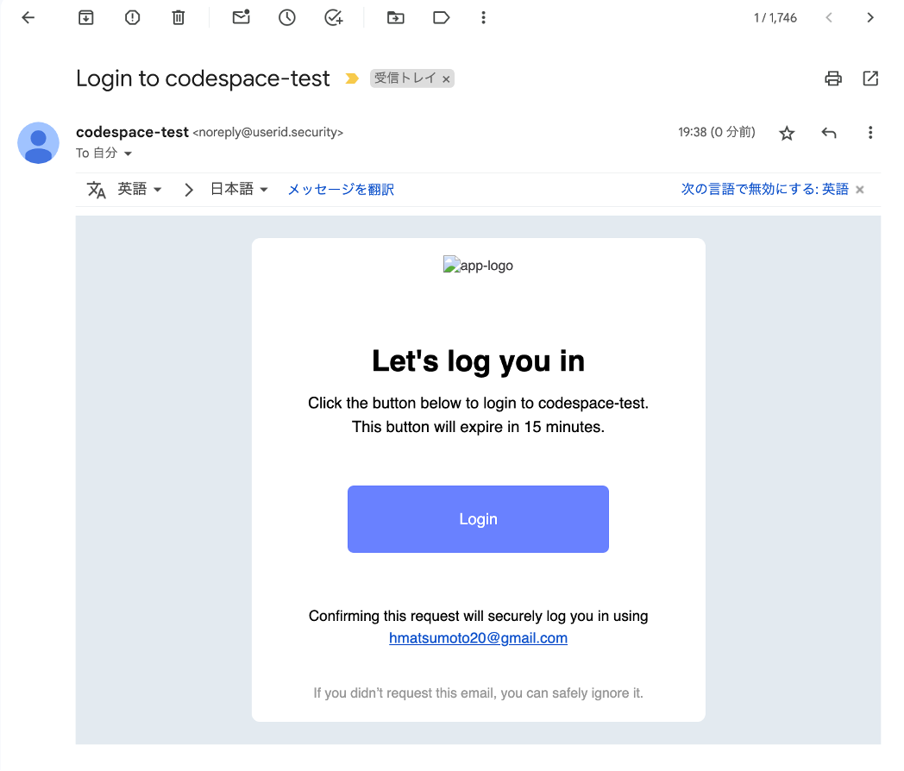
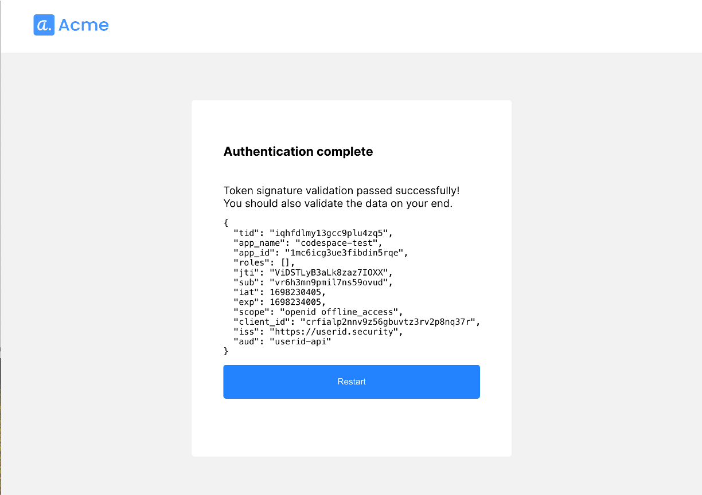

# Backend Email Magiclink Authentication

## 対象サンプルアプリケーション
- [login-with-be-magiclink](https://github.com/TransmitSecurity/ciam-expressjs-vanilla-samples/tree/main/login-with-be-magiclink)

## 処理フロー

### ログイン時の処理フロー



- 14以前(4,9)でAccess Token取得済みのため、14ではそのAccessTokenを利用するため新規取得を行いません


### 利用するTransmit SecurityのAPI

  | STEP | 役割 | API | 
  | --- | --- | --- |
  |4、9|APIに利用するAccessTokenの取得|[Get client access token](https://developer.transmitsecurity.com/openapi/token/#operation/getAccessToken)|
  |5|ユーザの作成|[Create User](https://developer.transmitsecurity.com/openapi/user/user/#operation/createUser)|
  |10|対象メールアドレスへMagiclinkの送信|[Backend Send email link](https://developer.transmitsecurity.com/openapi/user/backend-one-time-login/#operation/sendMagicLinkEmail)|
  |14|Magiclinkの評価|[Backend Authenticate email link](https://developer.transmitsecurity.com/openapi/user/backend-one-time-login/#operation/authenticateMagicLink)|


## はじめに
- 本ドキュメントではサンプルアプリケーションの利用に関する手順を示します
- サンプルアプリケーションを[ローカル環境で実行](./setup.md#ローカル環境で実行)した際の手順を示しています。試される環境に合わせて適宜アクセスするURLなど変更して操作ください
- EmailでMagiclinkを通知します。あらかじめEmail設定を完了してください

### 事前準備・前提
- 本ドキュメントでは以下が必要となります
  - インターネットに接続可能な端末
  - ブラウザ
  - 送受信可能なメールアドレス
  - 手順に応じた簡易なCLI操作・ファイル編集

## サンプルアプリケーションの実行
```
SAMPLE=login-with-be-magiclink yarn start
```

## 動作確認


### アプリケーション利用手順
- ブラウザでサンプルアプリケーション([http://localhost:8080](http://localhost:8080))に接続

#### ユーザー新規登録
- 初期画面がユーザー新規作成画面となります
   - `作成済みのユーザーでログインする場合には`画面下部の`Login`をクリックし、以降は[Magic Link](./login-with-be-magiclink.md#magic-link)を参照してください
   - アプリケーションの画面に、`(Platform上にアカウントが作成されていない)有効なメールアドレス`を入力し、下に表示されたボタンをクリック

  

- ユーザ作成が完了し、以下の画面が表示されます

  

#### Magic Link

- ユーザ作成完了の`Login`、または初期画面の`Login`ボタンをクリックすると、メールアドレス入力画面が表示されます。有効なアカウントの`メールアドレス`を入力し、ボタンをクリックしてください

  

- メールアドレスに対してMagiclinkを送信が完了した旨、メッセージが表示されます

  

- `有効なメールアドレス`の受信ボックスを開き、通知されたメール内の`Loginボタン(Magiclink)`をクリックします

  

- Loginボタンクリック後、操作が正しいことが確認できた後、画面が遷移します

  


<!--
### Developer Portal ステータス

> **Warning**
> Portalの機能、画面のデザインは日々アップデートされます。本ページの画像は参考情報としてご確認ください

## デバッグ
-->

## 参考情報
- [Backend Authentication/Login with email magic links](https://developer.transmitsecurity.com/guides/user/be_auth_email_magic_link/)