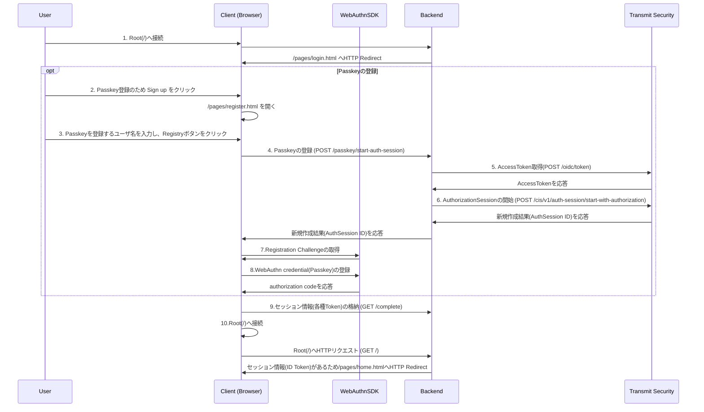
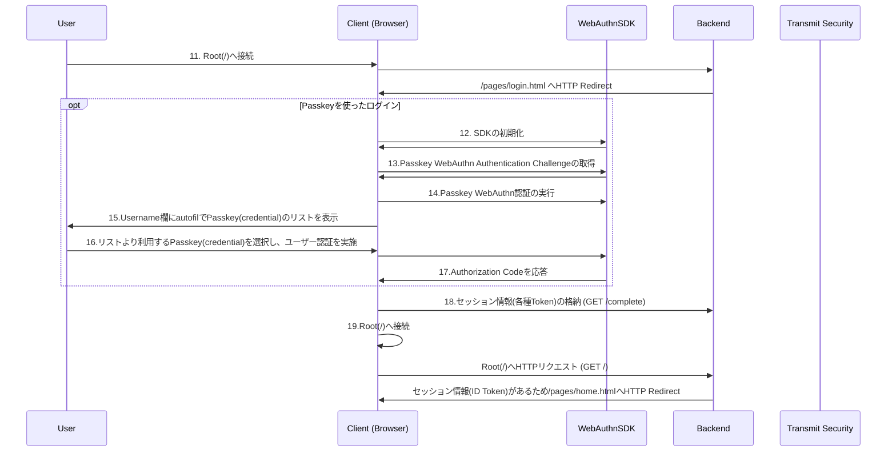

# Passkey Authentication (Old SDK Version)

## 対象サンプルアプリケーション

- [passkey-authentication](https://github.com/TransmitSecurity/ciam-expressjs-vanilla-samples/tree/main/passkey-authentication)
- このサンプルアプリケーションはパスキーを利用した認証を確認することができます
- このサンプルは OLD SDK を利用したサンプルの説明です。最新の情報は[こちら](./passkey-authentication.md)を参照してください。

## 処理フロー

### Passkey の登録



- 1./pages/login.html を開くと、Passkey でログインするためのスクリプトが動作します。本フローは Passkey の登録を説明するためこちらの動作を省略しています
- 6.Passkey 登録に必要となる AuthSession ID を取得します
- 7.Passkey の登録を行うため、事前に必要となる Registration Challenge を取得します。この Registration Challenge を取得するためには、6 の Backend で実行した API より取得した AuthSession ID をパラメータとして渡し、SDK の関数を実行します。実行の結果、取得した Challenge はローカルに保存されます
- 8.Passkey の登録を行います。ここで表示される画面に従ってユーザー認証を行うことにより、Passkey の登録が完了します

### Passkey を使ったログイン

- [Passkey の登録](./passkey-authentication.md#Passkeyの登録)で登録した Passkey を用いてログインします



- 12.Passkey WebAuthn を実行するため、初期化を行います。初期化の際に、Transmit Security Platform にあらかじめ登録したどのクライアントであるかを示す、ClientID を指定しています
- 13.Passkey WebAuthn の認証を行うため、事前に必要となる Passkey WebAuthn Authentication Challenge を取得します。実行の結果、取得した Challenge はローカルに保存されます
- 14.Passkey WebAuthn を実行します。autocomplete="username webauthn"を持つ input 要素に対し、autofill を使い credential のリストを表示します。ユーザーが利用する Passkey をリストより選択し、認証が完了した後、以降の処理に進みます

### 利用する Transmit Security の API/SDK

| STEP | 役割                                             | API / SDK                                                                                                                                       |
| ---- | ------------------------------------------------ | ----------------------------------------------------------------------------------------------------------------------------------------------- |
| 5    | API に利用する AccessToken の取得                | [Get client access token](https://developer.transmitsecurity.com/openapi/token/#operation/getAccessToken)                                       |
| 6    | AuthorizationSession の開始                      | [Start authorized session](https://developer.transmitsecurity.com/openapi/user/auth-sessions/#operation/startAuthorizedAuthSession)             |
| 7    | Registration Challenge の取得                    | [prepareWebauthnRegistration](https://developer.transmitsecurity.com/older-versions/guides/webauthn/webauthnsdk/#preparewebauthnregistration)   |
| 8    | WebAuthn credential(Passkey)の登録               | [executeWebauthnRegistration](https://developer.transmitsecurity.com/older-versions/guides/webauthn/webauthnsdk/#executewebauthnregistration)   |
| 12   | WebAuthn SDK の初期化                            | [init](https://developer.transmitsecurity.com/older-versions/guides/webauthn/webauthnsdk/#init)                                                 |
| 13   | Passkey WebAuthn Authentication Challenge の取得 | [preparePasskeyAuthentication](https://developer.transmitsecurity.com/older-versions/guides/webauthn/webauthnsdk/#preparepasskeyauthentication) |
| 14   | Passkey WebAuthn 認証の実行                      | [executePasskeyAuthentication](https://developer.transmitsecurity.com/older-versions/guides/webauthn/webauthnsdk/#executepasskeyauthentication) |

## はじめに

- 本ドキュメントではサンプルアプリケーションの利用に関する手順を示します
- サンプルアプリケーションを[GitHub の CodeSpace で実行](./setup.md#githubのcodespaceで実行)した際の手順を示しています。試される環境に合わせて適宜アクセスする URL など変更して操作ください

### 事前準備・前提

- 本ドキュメントでは以下が必要となります
  - インターネットに接続可能な端末
  - ブラウザ
  - 手順に応じた簡易な CLI 操作・ファイル編集
- 動作確認端末は生体認証(TouchID など)を備えているもの

## サンプルアプリケーションの実行

```
SAMPLE=passkey-authentication yarn start
```

## 動作確認

### アプリケーション利用手順

#### Passkey の登録

- ブラウザでサンプルアプリケーション`https://<codespace>-8080.app.github.dev`に接続します

- アプリケーション下部の`Sign up`をクリックしてください

  

- こちらのテストでは`username`に以下を入力し、`Register Passkey`をクリックします

  - `username` : test-user-01

  <p></p>

- 対象のサイトに対し Passkey を作成するか確認のポップアップが表示されます。`Continue`をクリックします

  <p></p>

> [!NOTE]
> 本手順は Google Chrome で操作をしています。Google Chrome はデフォルトで Google Chrome の Keychain に Passkey を登録します。Chrome では iCloud Keychain に登録することも可能です。そちらを希望する場合には、`User a different passkey`をクリックし、`iCloud Keychain`を選択してください
>
> <p></p>

- 対象のサイトに紐づく Passkey の登録を行うため、ユーザ認証を行います。テストを行なっている MAC には TouchID があるため、それを用いて認証します

  <p></p>

- 登録が完了します。その後、アプリケーションがログイン完了の画面に遷移します

  <p></p>

#### ログイン

- Username 入力欄をクリックすると、Passkey の選択メニューが表示されます。表示された中から、先ほど登録したアカウント名をクリックしてください

  <p></p>

- TouchID の操作が求められますので、こちらで認証します

  <p></p>

- 正しくログインすることができました。この結果より、こちらのサイトに対して Passkey の登録が完了し、正しくログインできたことがわかります

  <p></p>

### 参考: 異なるデバイスの Passkey を用いたログイン

- 同サイトに対し、異なる端末で Passkey のログインができるようになっている場合、ログインの際に異なるデバイスを利用することが可能です

- ログイン画面で`Use a Different Passkey`をクリックします

  <p></p>

  <p></p>

- QR コードが表示されるので、すでに Passkey の登録を行なっている別の端末で読み込みます

  <p></p>

- アプリケーションは別端末の操作の完了を待ちます

  <p></p>

- (モバイル端末)QR コードを読み込んだ端末でログインの操作を進めます

  <p></p>

- 端末でログイン操作が完了すると、アプリケーションがログイン完了となります

  <p></p>

### 参考: Chrome Passkey 管理画面

- `Google パスワード マネージャー` を開きます。左上のメニューから`設定`を開き、画面中断の`パスキーを管理`をクリックします
- 右上のテキストボックスにサイト名入力し、対象のサイトを検索できます
- 対象の Passkey 右側`：`から Passkey の削除が可能です

  <p></p>

  <p></p>

### 参考: iCloud Passkey 管理画面

- Apple 端末で、`設定`の`パスワード`を開きます
- 画面上部のテキストボックスにサイト名を入力し、対象のサイトを検索できます
- 対象の Passkey 右側`(i)`からエントリの詳細を確認し、最下部の`Delete`から Passkey の削除が可能です

  <p></p>

  <p></p>

<!--
## デバッグ
-->

## 参考情報

- [WebAuthn quick start: Web SDK](https://developer.transmitsecurity.com/guides/webauthn/quick_start_sdk/)
