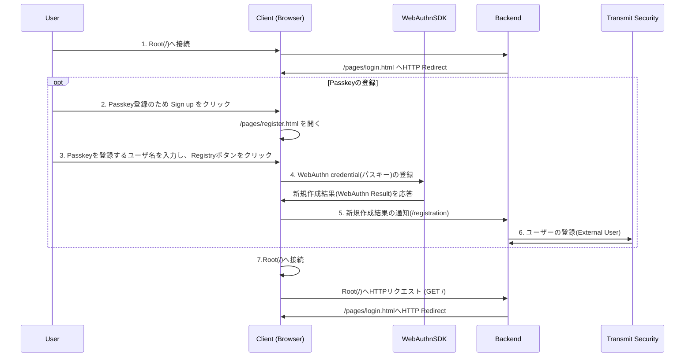
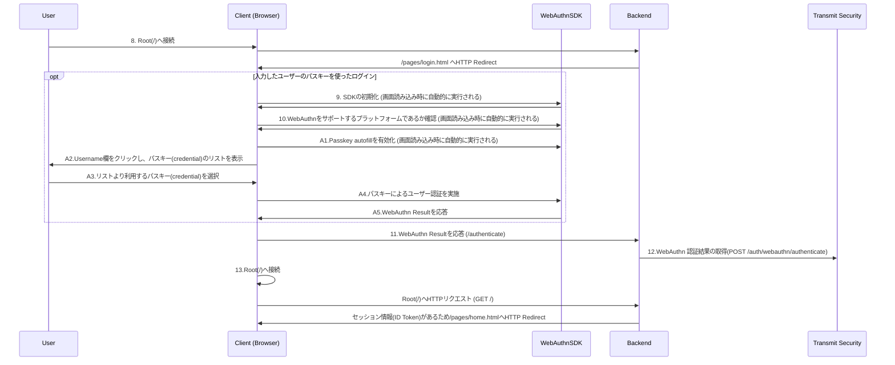
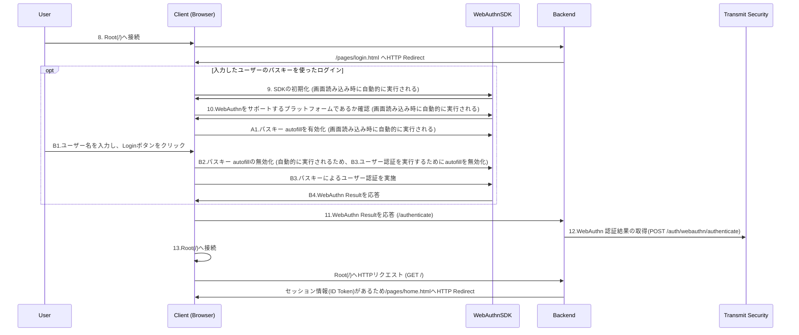
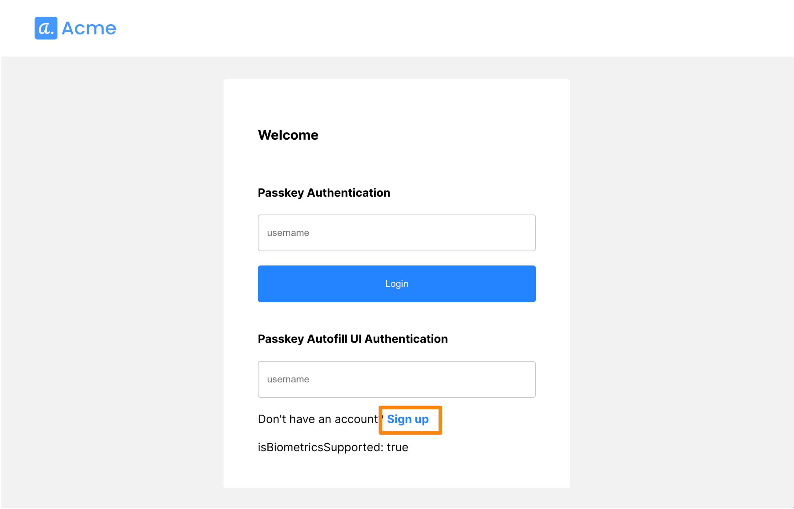
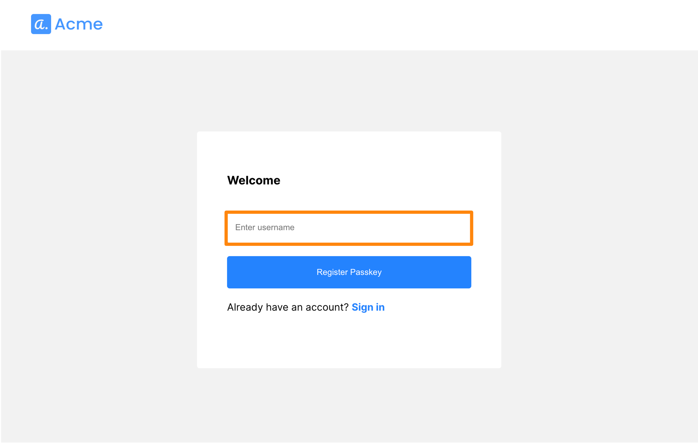
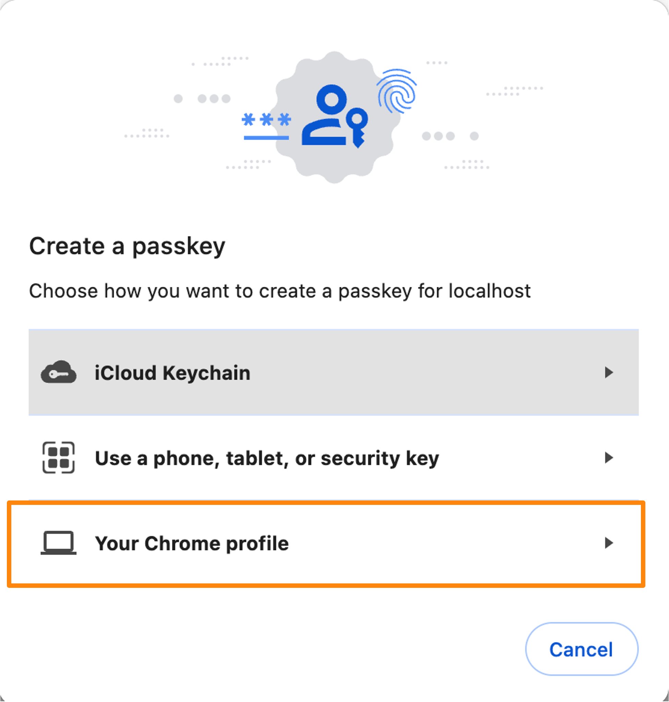
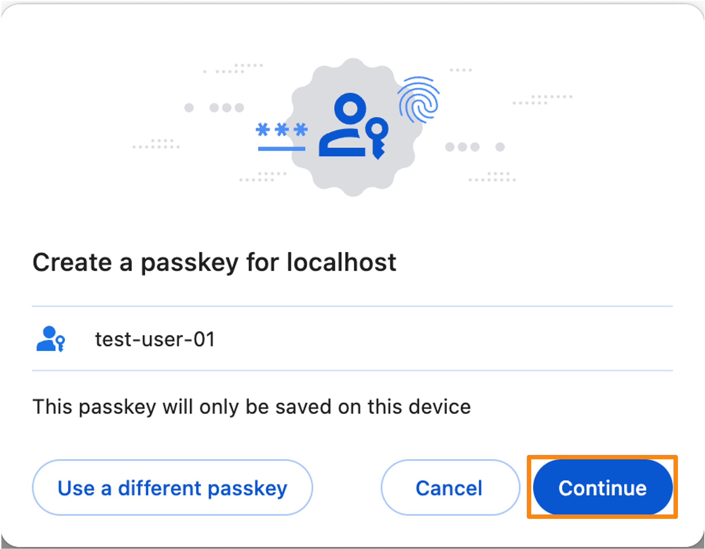
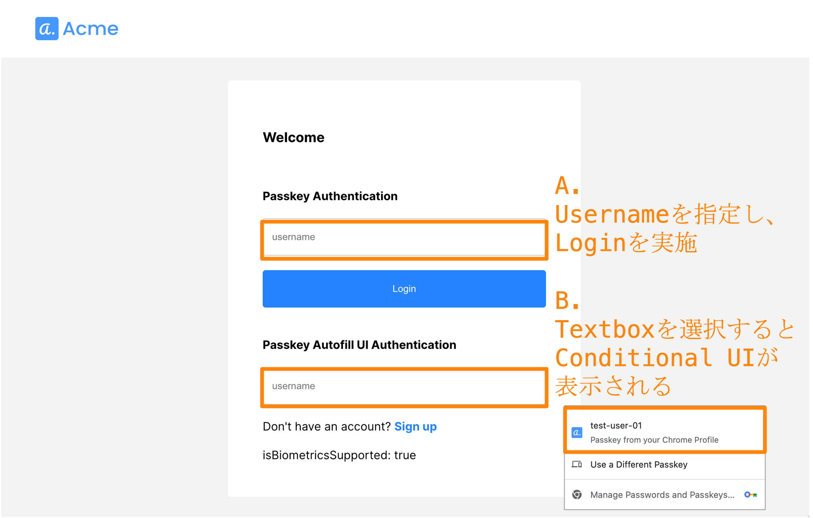
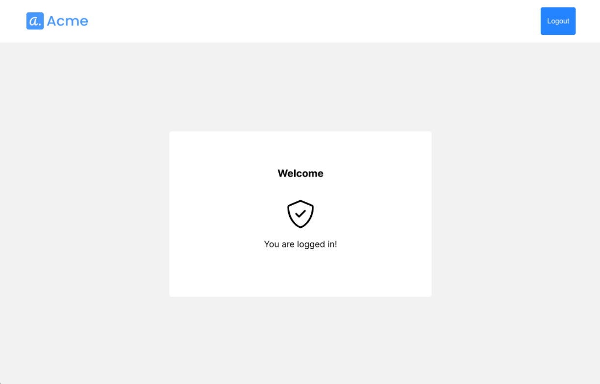
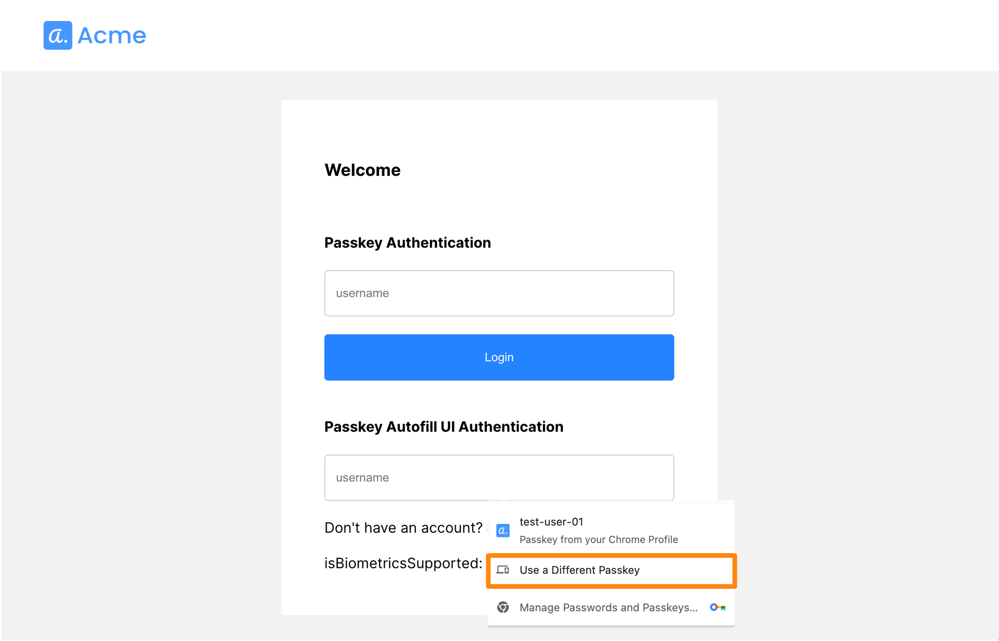

# Passkey Authentication

## 対象サンプルアプリケーション

- [passkey-authentication](https://github.com/TransmitSecurity/ciam-expressjs-vanilla-samples/tree/main/passkey-authentication)
- このサンプルアプリケーションはパスキーを利用した認証を確認することができます

> [!NOTE]
> 本手順は2024/03/12時点でPlatform SDKを利用するためのサンプル手順を示しています
> 別途、該当するサンプルアプリケーションがリリースされましたらそちらを利用してください


## 処理フロー

### パスキーの登録



- 1./pages/login.html を開くと、パスキーでログインするためのスクリプトが動作します。本フローは パスキーの登録を説明するためこちらの動作を省略しています
- 4.パスキーの登録を行います
- 5.パスキーの登録結果をバックエンド(/registration)へ通知します
- 6.パスキーの登録結果を用いてExternal Userとしてユーザーを登録します

### パスキーを使ったログイン

- [パスキーの登録](./passkey-authentication.md#Passkeyの登録)で登録したパスキーを用いてログインします
- こちらのサンプルアプリケーションでは、`A. Autofillによるログイン` 、 `B. 入力したユーザーのパスキーを使ったログイン`2種類のログイン方法を確認できます。該当する操作のフローを確認してください

- A. Autofillによるログイン


 
- B. 入力したユーザーのパスキーを使ったログイン





- 9.パスキーの認証を実行するため、初期化を行います。初期化の際に、Transmit Security Platform にあらかじめ登録したどのクライアントであるかを示す、ClientID を指定しています
- A1.パスキーの認証を実行します。autocomplete="username webauthn"を持つ input 要素に対し、autofill を使い credential のリストを表示します。ユーザーが利用するパスキーをリストより選択し、認証が完了した後、以降の処理に進みます
- A4.パスキーによるユーザー認証を実行し、A5.実行結果をClientに応答します
- B3でパスキーによるユーザー認証を実行するため、B2でパスキーautofillを無効化します
- B3.パスキーによるユーザー認証を実行し、B4.実行結果をClientに応答します
- バックエンドサーバが11.でパスキーによるユーザ認証の結果を取得し、12.で認証を完了します

### 利用する Transmit Security の API/SDK

| STEP | 役割                                             | API / SDK                                                                                                                                       |
| ---- | ------------------------------------------------ | ----------------------------------------------------------------------------------------------------------------------------------------------- |
| 4    | WebAuthn credential(パスキー)の登録    | [webauthn.register](https://developer.transmitsecurity.com/sdk-ref/platform/modules/webauthn/#register)   |
| 6    | パスキー登録を行ったユーザーの登録                            | [Register for logged-out user](https://developer.transmitsecurity.com/openapi/user/backend-webauthn/#operation/webauthn-registration-external)                                                 |
| 10   | WebAuthnをサポートするプラットフォームか確認 | [webauthn.isPlatformAuthenticatorSupported](https://developer.transmitsecurity.com/sdk-ref/platform/modules/webauthn/#isplatformauthenticatorsupported) |
| A1   | パスキー autofillを有効化                      | [webauthn.authenticate.autofill.activate](https://developer.transmitsecurity.com/sdk-ref/platform/interfaces/autofillhandlers/#activate) |
| B2   | パスキー autofillを無効化                      | [webauthn.authenticate.autofill.abort](https://developer.transmitsecurity.com/sdk-ref/platform/interfaces/autofillhandlers/#abort) |
| B3   | 入力したユーザ名を使ったパスキー認証              | [webauthn.authenticate.modal](https://developer.transmitsecurity.com/sdk-ref/platform/interfaces/webauthnauthenticationflows/#modal) |
| 12   | パスキー WebAuthn 認証の実行                      | [Authenticate WebAuthn](https://developer.transmitsecurity.com/openapi/user/backend-webauthn/#operation/authenticateWebauthnCredential) |

## はじめに

- 本ドキュメントではサンプルアプリケーションの利用に関する手順を示します
- サンプルアプリケーションを[ローカル環境で実行](./setup.md#ローカル環境で実行)した際の手順を示しています。試される環境に合わせて適宜アクセスする URL など変更して操作ください

### 事前準備・前提

- 本ドキュメントでは以下が必要となります
  - インターネットに接続可能な端末
  - ブラウザ
  - 手順に応じた簡易な CLI 操作・ファイル編集
- 動作確認端末は生体認証(TouchID など)を備えているもの

## 一部実装の変更

- Platform SDK を用いたパスキーを利用するため、以下の手順にしたがって環境をセットアップしてください

### ファイルのコピー

```shell
cp -r ~/ciam-expressjs-vanilla-samples/passkey-authentication ~/ciam-expressjs-vanilla-samples/passkey-authentication-platformsdk
cd ~/ciam-expressjs-vanilla-samples/
```

### HTML ファイルの修正

- `passkey-authentication-platformsdk/pages`配下の`login.html`を以下の内容に変更してください

```html
<html>
  <head>
    <link rel="icon" type="image/svg+xml" href="/acme-icon.svg" />
    <link rel="preconnect" href="https://fonts.googleapis.com" />
    <link rel="preconnect" href="https://fonts.gstatic.com" crossorigin />
    <link
      href="https://fonts.googleapis.com/css2?family=Inter:wght@400;700&display=swap"
      rel="stylesheet"
    />
    <meta name="viewport" content="width=device-width, initial-scale=1.0" />
    <title>ACME</title>

    <script type="module" src="./init.js"></script>
    <!-- Load the latest SDK version within 1.6 range
    See changelog for details and update version if necessary -->
    <script
      type="text/javascript"
      src="https://platform-websdk.transmitsecurity.io/platform-websdk/1.6.x/ts-platform-websdk.js"
      defer="true"
      id="ts-platform-script"
    ></script>
    <script>
      async function initPage() {
        // Set init params
        const config = {
          clientId: window.env.VITE_TS_CLIENT_ID,
          serverPath:
            window.env.VITE_TS_API_BASE || "https://api.transmitsecurity.io",
        };
        // Initialize the SDK
        console.log("Initializing SDK");
        await window.tsPlatform.initialize({
          clientId: config.clientId,
          webauthn: { serverPath: config.serverPath },
        });

        // WebAuthn Support Platform Check
        const isBiometricsSupported =
          await window.tsPlatform.webauthn.isPlatformAuthenticatorSupported();
        window.pageUtils.updateElementText(
          "webAuthnSupportStatus",
          `isBiometricsSupported: ${isBiometricsSupported}`
        );
        console.log(`isBiometricsSupported: ${isBiometricsSupported}`);

        // Activate the passkey autofill
        window.tsPlatform.webauthn.authenticate.autofill.activate({
          onSuccess: handleSuccessfulPasskeyValidation, // Handle successful authentication
          onError: handleAutofillError, // Handle error or passkey cancellation
        });

        async function handleSuccessfulPasskeyValidation(
          webauthnEncodedResult
        ) {
          console.log("webauthnEncodedResult", webauthnEncodedResult);
          // Add code here that sends the encoded result to your backend to complete the authentication flow
          await fetch(`/authenticate?code=${webauthnEncodedResult}`);
          window.location.replace("/");
        }

        async function handleAutofillError(error) {
          if (error.errorCode === "autofill_authentication_aborted") return; // Authentication canceled by user
          console.log(error);
        }
      }

      // Assumes device is already registered so no need to check for WebAuthn support
      async function onAuthenticate() {
        // abort auto fill before passkey authentication
        await window.tsPlatform.webauthn.authenticate.autofill.abort();

        // Collect user input
        const username = document.getElementById("username").value;

        // Perform biometric authentication on device
        console.log("Display available credentials and sign the challenge");
        const webauthnEncodedResult =
          await window.tsPlatform.webauthn.authenticate.modal(username);
        console.log(`webauthnEncodedResult: ${webauthnEncodedResult}`);
        // Send authentication result to backend to obtains user tokens from Transmit
        console.log("Finish authentication and fetch the access token");
        await fetch(`/authenticate?code=${webauthnEncodedResult}`);

        window.location.replace("/");
      }
    </script>
  </head>

  <body onload="initPage()">
    <div class="page" id="page">
      <header>
        <a href="/"></a>
      </header>
      <main>
        <div class="content column gap">
          <h3>Welcome</h3>

          <div>
            <h4>パスキーAuthentication</h4>
            <input id="username" placeholder="username" style="width: 100%" />
          </div>

          <button
            class="full-width"
            id="authenticate"
            onclick="onAuthenticate()"
          >
            Login
          </button>

          <div>
            <h4>Passkey Autofill UI Authentication</h4>

            <input
              type="text"
              style="width: 100%"
              placeholder="username"
              autocomplete="username webauthn"
            />
          </div>
          <div class="row">
            Don&apos;t have an account?
            <a href="/pages/register.html">Sign up</a>
          </div>
          <div id="webAuthnSupportStatus"></div>
        </div>
      </main>
    </div>
  </body>
</html>
```

- `passkey-authentication-platformsdk/pages`配下の`register.html`を以下の内容に変更してください

```html
<!DOCTYPE html>
<html style="display: none">
  <head>
    <link rel="icon" type="image/svg+xml" href="/acme-icon.svg" />
    <link rel="preconnect" href="https://fonts.googleapis.com" />
    <link rel="preconnect" href="https://fonts.gstatic.com" crossorigin />
    <link
      href="https://fonts.googleapis.com/css2?family=Inter:wght@400;700&display=swap"
      rel="stylesheet"
    />
    <meta name="viewport" content="width=device-width, initial-scale=1.0" />
    <title>ACME</title>
    <script
      type="text/javascript"
      src="https://platform-websdk.transmitsecurity.io/platform-websdk/1.6.x/ts-platform-websdk.js"
      defer="true"
      id="ts-platform-script"
    ></script>
    <script type="module" src="./init.js"></script>
    <script>
      async function registerPasskey() {
        try {
          window.pageUtils.showLoading();
          const usernameInput = document.getElementById("username");
          const username = usernameInput.value;

          // Set init params
          const config = {
            clientId: window.env.VITE_TS_CLIENT_ID,
            serverPath:
              window.env.VITE_TS_API_BASE || "https://api.transmitsecurity.io",
          };
          // Initialize the SDK
          console.log("Initializing SDK");
          await window.tsPlatform.initialize({
            clientId: config.clientId,
            webauthn: { serverPath: config.serverPath },
          });

          if (username) {
            const encodedResult = await window.tsPlatform.webauthn.register(
              username
            );
            await fetch(
              `/registration?code=${encodedResult}&username=${username}`
            );

            window.location.replace("/");
            return;
          } else {
            window.pageUtils.updateElementText("status", `Username required`);
          }
        } catch (ex) {
          console.log(ex);
          window.pageUtils.updateElementText("status", `${ex.description}`);
        }

        window.pageUtils.hideLoading();
      }
    </script>
  </head>
  <body>
    <div class="page" id="page">
      <header>
        <a href="/"></a>
      </header>
      <main>
        <div class="content column gap">
          <h3>Welcome</h3>
          <input
            id="username"
            type="text"
            size="40"
            placeholder="Enter username"
          />
          <button
            id="registerPasskey"
            onclick="registerPasskey()"
            class="full-width"
          >
            Register Passkey
          </button>
          <div class="row">
            Already have an account? <a href="/pages/login.html">Sign in</a>
          </div>
          <div id="status"></div>
        </div>
      </main>
    </div>
  </body>
</html>
```

### バックエンドサーバ ファイルの修正

- バックエンドの index.js ファイルの修正。`passkey-authentication-platformsdk/backend/routes`配下の`index.js`を以下の内容に変更してください

```javascript
import express from "express";
import fetch from "node-fetch";
import { common } from "@ciam-expressjs-vanilla-samples/shared";

const router = express.Router();

router.get(["/"], async function (req, res) {
  if (!req.session?.tokens) {
    res.redirect("/pages/login.html");
  } else {
    res.redirect("/pages/home.html");
  }
});

// Get an authenticated user's saved ID Token or return a not found error
router.get("/user", async function (req, res) {
  // TODO add error handling, omitted for sample clarity
  console.log("/user", req.session.tokens);
  if (req.session.tokens) {
    res.status(200).send({
      idToken: req.session.tokens.idToken,
    });
  } else {
    res.status(404).send({
      idToken: null,
    });
  }
});

// Logout user
router.post("/logout", common.utils.rateLimiter(), async function (req, res) {
  req.session.tokens = undefined;
  req.session.save();

  res.send("{}");
});

// Authenticate Passkey
router.get("/authenticate", async function (req, res) {
  const params = new URLSearchParams(req.query);
  const encodedResult = params.get("code");
  console.log("encodedResult", encodedResult);

  const url = common.config.apis.webauthnToken;

  // In this sample we are demonstrating Passkey registration for users managed externally.
  // For more information see https://developer.transmitsecurity.com/guides/webauthn/basic_login_scenarios/
  const accessToken = await common.tokens.getClientCredsToken();

  if (!accessToken) {
    throw new Error("Access token missing from session");
  }

  const data = await fetch(url, {
    method: "POST",
    headers: {
      "Content-Type": "application/json",
      Authorization: `Bearer ${accessToken}`,
    },
    body: JSON.stringify({
      webauthn_encoded_result: encodedResult, // Returned by authenticate.modal() SDK call
    }),
  });

  const tokens = await data.json();
  console.log("Authenticate", tokens);

  if (tokens.id_token) {
    const idToken = common.tokens.parseJwt(tokens.id_token);
    req.session.tokens = {
      accessToken: tokens.access_token,
      refreshToken: tokens.refresh_token,
      idToken,
    };
    req.session.save();
  }

  res.redirect("/");
});

// Register Passkey
router.get("/registration", async function (req, res) {
  const params = new URLSearchParams(req.query);
  const encodedResult = params.get("code");
  const username = params.get("username");
  console.log("encodedResult", encodedResult);

  const url = common.config.apis.webauthnToken;

  // In this sample we are demonstrating Passkey registration for users managed externally.
  // For more information see https://developer.transmitsecurity.com/guides/webauthn/basic_login_scenarios/
  const accessToken = await common.tokens.getClientCredsToken();

  if (!accessToken) {
    throw new Error("Access token missing from session");
  }

  const data = await fetch(
    `https://api.transmitsecurity.io/cis/v1/auth/webauthn/external/register`, // Use api.eu.transmitsecurity.io for EU, api.ca.transmitsecurity.io for CA
    {
      method: "POST",
      headers: {
        "Content-Type": "application/json",
        Authorization: `Bearer ${accessToken}`,
      },
      body: JSON.stringify({
        webauthn_encoded_result: encodedResult, // Returned by authenticate.modal() SDK call
        external_user_id: username, // Identifier of the user in your system
      }),
    }
  );

  const tokens = await data.json();
  console.log("Authenticate", tokens);

  res.redirect("/");
});
```

## サンプルアプリケーションの実行

```
## cd ~/ciam-expressjs-vanilla-samples/
SAMPLE=passkey-authentication-platformsdk yarn start
```

## 動作確認

### アプリケーション利用手順

#### パスキーの登録

- ブラウザでサンプルアプリケーション`https://localhost:8080`に接続します

- アプリケーション下部の`Sign up`をクリックしてください

  

- こちらのテストでは`username`に以下を入力し、`Register Passkey`をクリックします

  - `username` : test-user-01

  <p></p>

- 対象のサイトに対しパスキーを作成するか確認のポップアップが表示されます。作成するパスキーをクリックします

  <p></p>

  <p></p>

- 対象のサイトに紐づくパスキーの登録を行います。テストを行なっている MAC には TouchID があるため、それを用いて認証します

#### ログイン

- こちらのサンプルアプリケーションでは、2種類のログイン方法を確認できます。以下の希望する認証方式を試してください。

  - A. ユーザ名を入力し、Login をクリックし、認証を実行します

  <p></p>

  - B. Username 入力欄をクリックすると、パスキーの選択メニューが表示されます。表示された中から、先ほど登録したアカウント名をクリックし認証を実行します

- TouchID の操作が求められますので、認証します

- 正しくログインすることができました。この結果より、こちらのサイトに対してパスキーの登録が完了し、正しくログインできたことがわかります

  <p></p>

### 参考: 異なるデバイスのパスキーを用いたログイン

- 同サイトに対し、異なる端末でパスキーのログインができるようになっている場合、ログインの際に異なるデバイスを利用することが可能です

- ログイン画面で`Use a Different Passkey`をクリックします

  <p></p>

  <p></p>

- QR コードが表示されるので、すでにパスキーの登録を行なっている別の端末で読み込みます

  <p></p>

- アプリケーションは別端末の操作の完了を待ちます

  <p></p>

- (モバイル端末)QR コードを読み込んだ端末でログインの操作を進めます

  <p></p>

- 端末でログイン操作が完了すると、アプリケーションがログイン完了となります

  <p></p>

### 参考: Chrome パスキー管理画面

- `Google パスワード マネージャー` を開きます。左上のメニューから`設定`を開き、画面中断の`パスキーを管理`をクリックします
- 右上のテキストボックスにサイト名入力し、対象のサイトを検索できます
- 対象のパスキー右側`：`からパスキーの削除が可能です

  <p></p>

  <p></p>

### 参考: iCloud パスキー管理画面

- Apple 端末で、`設定`の`パスワード`を開きます
- 画面上部のテキストボックスにサイト名を入力し、対象のサイトを検索できます
- 対象のパスキー右側`(i)`からエントリの詳細を確認し、最下部の`Delete`からパスキーの削除が可能です

  <p></p>

  <p></p>

<!--
## デバッグ
-->

## 参考情報

- [WebAuthn quick start: Web SDK](https://developer.transmitsecurity.com/guides/webauthn/quick_start_sdk/)
