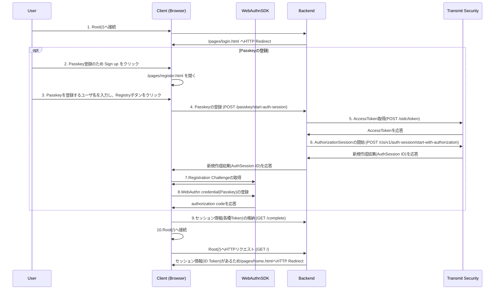
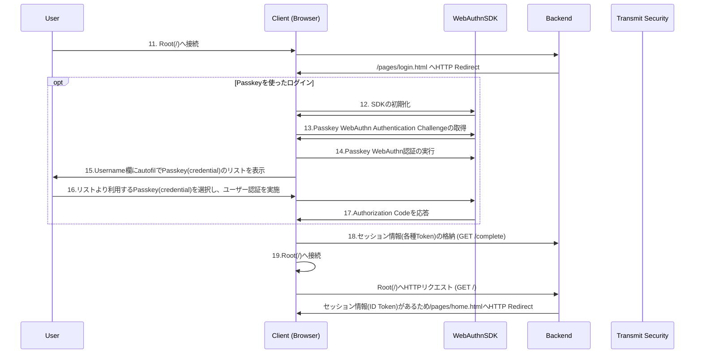

# Passkey Authentication

## 対象サンプルアプリケーション
- [passkey-authentication](https://github.com/TransmitSecurity/ciam-expressjs-vanilla-samples/tree/main/passkey-authentication)
- このサンプルアプリケーションはユーザ名・パスワードを利用した認証を確認することができます

## 処理フロー

### Passkeyの登録



- 1./pages/login.htmlを開くと、Passkeyでログインするためのスクリプトが動作します。本フローはPasskeyの登録を説明するためこちらの動作を省略しています
- 6.Passkey登録に必要となるAuthSession IDを取得します
- 7.Passkeyの登録を行うため、事前に必要となるRegistration Challengeを取得します。このRegistration Challengeを取得するためには、6のBackendで実行したAPIより取得したAuthSession IDをパラメータとして渡し、SDKの関数を実行します。実行の結果、取得したChallengeはローカルに保存されます
- 8.Passkeyの登録を行います。ここで表示される画面に従ってユーザー認証を行うことにより、Passkeyの登録が完了します

### Passkeyを使ったログイン
- [Passkeyの登録](./passkey-authentication.md#Passkeyの登録)で登録したPasskeyを用いてログインします



- 12.Passkey WebAuthnを実行するため、初期化を行います。初期化の際に、Transmit Security Platformにあらかじめ登録したどのクライアントであるかを示す、ClientIDを指定しています
- 13.Passkey WebAuthnの認証を行うため、事前に必要となるPasskey WebAuthn Authentication Challengeを取得します。実行の結果、取得したChallengeはローカルに保存されます
- 14.Passkey WebAuthnを実行します。autocomplete="username webauthn"を持つinput要素に対し、autofillを使いcredentialのリストを表示します。ユーザーが利用するPasskeyをリストより選択し、認証が完了した後、以降の処理に進みます

### 利用するTransmit SecurityのAPI/SDK

  | STEP | 役割 | API / SDK | 
  | --- | --- | --- |
  |5|APIに利用するAccessTokenの取得|[Get client access token](https://developer.transmitsecurity.com/openapi/token/#operation/getAccessToken)|
  |6|AuthorizationSessionの開始|[Start authorized session](https://developer.transmitsecurity.com/openapi/user/auth-sessions/#operation/startAuthorizedAuthSession)|
  |7|Registration Challengeの取得|[prepareWebauthnRegistration](https://developer.transmitsecurity.com/sdk-ref/webauthn/interfaces/webauthnsdk/#preparewebauthnregistration)|
  |8|WebAuthn credential(Passkey)の登録|[executeWebauthnRegistration](https://developer.transmitsecurity.com/sdk-ref/webauthn/interfaces/webauthnsdk/#executewebauthnregistration)|
  |12|WebAuthn SDKの初期化|[init](https://developer.transmitsecurity.com/sdk-ref/webauthn/interfaces/webauthnsdk/#init)|
  |13|Passkey WebAuthn Authentication Challengeの取得|[preparePasskeyAuthentication](https://developer.transmitsecurity.com/sdk-ref/webauthn/interfaces/webauthnsdk/#preparepasskeyauthentication)|
  |14|Passkey WebAuthn認証の実行|[executePasskeyAuthentication](https://developer.transmitsecurity.com/sdk-ref/webauthn/interfaces/webauthnsdk/#executepasskeyauthentication)|


## はじめに
- 本ドキュメントではサンプルアプリケーションの利用に関する手順を示します
- サンプルアプリケーションを[GitHubのCodeSpaceで実行](./setup.md#githubのcodespaceで実行)した際の手順を示しています。試される環境に合わせて適宜アクセスするURLなど変更して操作ください

### 事前準備・前提
- 本ドキュメントでは以下が必要となります
  - インターネットに接続可能な端末
  - ブラウザ
  - 手順に応じた簡易なCLI操作・ファイル編集
- 動作確認端末は生体認証(TouchIDなど)を備えているもの

## サンプルアプリケーションの実行
```
SAMPLE=passkey-authentication yarn start
```

## 動作確認

### アプリケーション利用手順

#### Passkeyの登録

- ブラウザでサンプルアプリケーション`https://<codespace>-8080.app.github.dev`に接続します

- アプリケーション下部の`Sign up`をクリックしてください

  

- こちらのテストでは`username`に以下を入力し、`Register Passkey`をクリックします
  - `username` : test-user-01

  <p></p>

- 対象のサイトに対しPasskeyを作成するか確認のポップアップが表示されます。`Continue`をクリックします

  <p></p>

> [!NOTE]
> 本手順はGoogle Chromeで操作をしています。Google ChromeはデフォルトでGoogle ChromeのKeychainにPasskeyを登録します。ChromeではiCloud Keychainに登録することも可能です。そちらを希望する場合には、`User a different passkey`をクリックし、`iCloud Keychain`を選択してください
> 
> <p></p>

- 対象のサイトに紐づくPasskeyの登録を行うため、ユーザ認証を行います。テストを行なっているMACにはTouchIDがあるため、それを用いて認証します

  <p></p>

- 登録が完了します。その後、アプリケーションがログイン完了の画面に遷移します

  <p></p>

#### ログイン

- Username入力欄をクリックすると、Passkeyの選択メニューが表示されます。表示された中から、先ほど登録したアカウント名をクリックしてください

  <p></p>

- TouchIDの操作が求められますので、こちらで認証します

  <p></p>

- 正しくログインすることができました。この結果より、こちらのサイトに対してPasskeyの登録が完了し、正しくログインできたことがわかります

  <p></p>

### 参考: 異なるデバイスのPasskeyを用いたログイン
- 同サイトに対し、異なる端末でPasskeyのログインができるようになっている場合、ログインの際に異なるデバイスを利用することが可能です

- ログイン画面で`Use a Different Passkey`をクリックします

  <p></p>

  <p></p>

- QRコードが表示されるので、すでにPasskeyの登録を行なっている別の端末で読み込みます

  <p></p>

- アプリケーションは別端末の操作の完了を待ちます

  <p></p>

- (モバイル端末)QRコードを読み込んだ端末でログインの操作を進めます

  <p></p>

- 端末でログイン操作が完了すると、アプリケーションがログイン完了となります

  <p></p>

### 参考: Chrome Passkey 管理画面

- `Google パスワード マネージャー` を開きます。左上のメニューから`設定`を開き、画面中断の`パスキーを管理`をクリックします
- 右上のテキストボックスにサイト名入力し、対象のサイトを検索できます
- 対象のPasskey右側`：`からPasskeyの削除が可能です

  <p></p>

  <p></p>

### 参考: iCloud Passkey 管理画面

- Apple端末で、`設定`の`パスワード`を開きます
- 画面上部のテキストボックスにサイト名を入力し、対象のサイトを検索できます
- 対象のPasskey右側`(i)`からエントリの詳細を確認し、最下部の`Delete`からPasskeyの削除が可能です

  <p></p>

  <p></p>


<!--
## デバッグ
-->

## 参考情報
- [WebAuthn quick start: Web SDK](https://developer.transmitsecurity.com/guides/webauthn/quick_start_sdk/)


