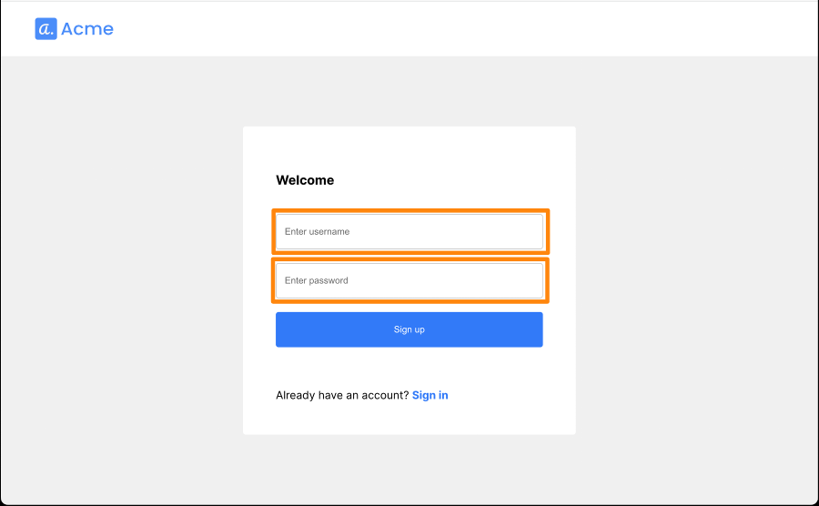
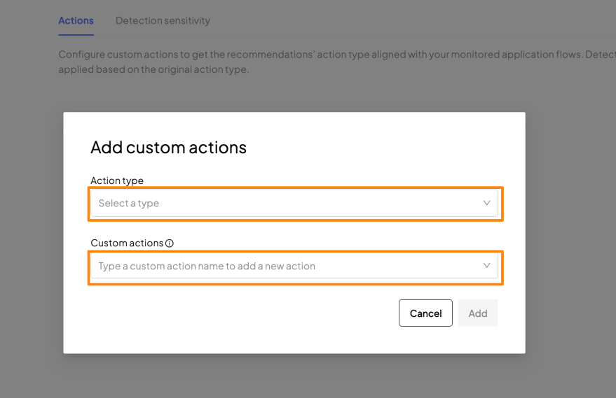
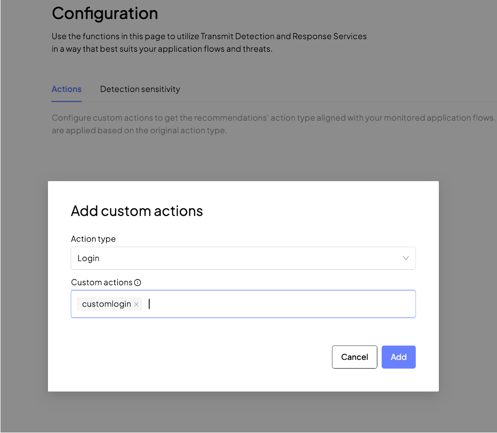

# Detection and Response Service

## 対象サンプルアプリケーション
- [password-authentication-drs](https://github.com/TransmitSecurity/ciam-expressjs-vanilla-samples/tree/main/password-authentication-drs)
- このサンプルアプリケーションはDetection and Response Serviceにより悪意ある通信を識別し、制御する機能の振る舞いを確認することができます

## はじめに
- 本ドキュメントではサンプルアプリケーションの利用に関する手順を示します
- サンプルアプリケーションを[ローカル環境で実行](./setup.md#ローカル環境で実行)した際の手順を示しています。試される環境に合わせて適宜アクセスするURLなど変更して操作ください

### 事前準備・前提
- 本ドキュメントでは以下が必要となります
  - インターネットに接続可能な端末
  - ブラウザ
  - 手順に応じた簡易なCLI操作・ファイル編集

## サンプルアプリケーションの実行
```
SAMPLE=password-authentication-drs yarn start
```

## 動作確認

### アプリケーション利用手順

#### 初回接続時：アカウントの登録

- ブラウザでサンプルアプリケーション([http://localhost:8080](http://localhost:8080))に接続します

- アプリケーション下部の`Sign up`をクリックしてください

  

- 作成するアカウントの`username`、`passsword`を入力し、`Sign up`をクリックしてください
- 作成する`password`は、Portalのパスワードポリシーの設定に従う必要があります。
  - Portal: 左側メニュー`Authentication`を開き、対象のアプリケーション`codespace-test`をプルダウンより選択してください。画面の`Passwords`を開き、パスワードポリシーを確認してください。初期設定のポリシーは以下です

  

- こちらのテスト実行では以下の内容を入力しています
  - `username` : test-user-01
  - `Password` : TestP@ssw0rd

  

- 正しく登録が完了すると、認証後を想定したサンプル画面が表示されます

  

- 画面中央のボタンをクリックすると、現在接続しているクライアント（先ほど登録したユーザで操作するこのセッション）のRisk値を知ることができます

  

- 画面右上のログアウトボタンより一度ログアウトします

#### ログイン成功の操作

- 先ほど登録したユーザ情報でログインします

  

- 正しくログインすることができました。この結果より先ほどのユーザ情報は正しくTransmit Securityに登録ができており、ユーザ認証が完了したことがわかります。
- ログイン後の画面は先ほどと同様で、Risk値を確認することができます
- ログアウトボタンより一度ログアウトします

#### ログイン失敗の操作

- 先ほど登録した情報とは異なる`username`を入力し、動作を確認します
  - `username` : test-user-02
  - `Password` : TestP@ssw0rd

- エラーにより認証が失敗しました

- 操作は以上です。Portalにてどのように情報が見えるか確認します

#### Portalの確認

> **Warning**
> Portalの機能、画面のデザインは日々アップデートされます。本ページの画像は参考情報としてご確認ください


##### Usersの確認

- 左のメニューから`Users`を開きます。対象のUser右側の`:`のボタンをクリックし、`User details`をクリックしてください

  

- `Recommendations`のタブを開いてください。Detection and Response Serviceの機能により、通信制御の内容を確認することができます

  

- `Activities`のタブを開いてください。通信制御の内容を確認することができます

  

  - 初期の表示では画面上部が最新となります
  - 実際に操作した内容の通りエントリが表示されていることが確認できます

##### Detection and Response Serviceの確認

- 左のメニューの`Detection and Response` > `Overview`を開きます

  

- 左のメニューの`Detection and Response` >  `Recommendations`を開きます

  

  - 対象のエントリをクリックすることで詳細の情報を確認できます

  

  - 対象のエントリに対しいくつか操作を実施することが可能です。エントリ右側`:`をクリックし、メニューを選択してください。メニューの詳細についてはドキュメントを確認してください

  


### UserID、ActionTypeの指定
- Detection and Response ServiceのRecommendationsはアプリケーションに対するクライアントの通信の状況や、どのようなリスクが見られるか把握することが可能です
- サンプルアプリケーションに、JavaScript・HTMLを追加し、通信の詳細がどのように表示されるか確認します

#### HTMLファイルの修正
- `password-authentication-drs/pages`配下の`home.html`を修正してください
  - サンプルの動作環境での修正方法は以下です
  
  ```shell
  ## * vi がない場合
  ## apt update && apt install vim -y
  vi ~/ciam-expressjs-vanilla-samples/password-authentication-drs/pages/home.html
  ```

- script タグ内にJavaScriptの関数を追加します。
`</head>`上の`</script>`の直前に以下を追加してください。

  ```javascript
      // set UserID from textbox
      async function setUserId(userId) {
        var userid = document.getElementById("setusername").value;
        window.myTSAccountProtection.setAuthenticatedUser(userid);
        var useridtext = document.getElementById("useridtext");
        useridtext.innerHTML = "UserID: "+userid;
      }
      // claer UserID
      async function clearUser() {
        window.myTSAccountProtection.clearUser();
        var useridtext = document.getElementById("useridtext");
        useridtext.innerHTML = "";
        document.getElementById("setusername").value = "";
      }
  
      // report Action
      async function reportAction(actionType) {
        window.myTSAccountProtection.triggerActionEvent(actionType).then((actionResponse) => {
          let actionToken = actionResponse.actionToken;
          console.log('Action Token', actionToken);
        });
      }
  ```
- HTML main 内に先ほど追加した関数を実行するHTMLを追加します。
`</main>`上の`</div>`の上に以下を追加してください

  ```html
  <!-- Set/Unset UserID -->
  <p>
    <h4>Set / Unset User ID</h3>
    <div id="useridtext"></div>
    <input type="text" id="setusername" class="textbox" style="width:100%;" placeholder="Set Username"/>
    <button class="full-width" onclick="setUserId()">Set UserId</button>
    <button class="full-width" onclick="clearUser()">Clear UserId</button>
  </p>
  
  <!-- Report Action -->
  <p>
    <h4>Report Action Button</h4>
    <button class="btn" style="margin:5px;" onclick="reportAction('register')">register</button>
    <button class="btn" style="margin:5px;" onclick="reportAction('transaction')">transaction</button>
    <button class="btn" style="margin:5px;" onclick="reportAction('checkout')">checkout</button>
    <button class="btn" style="margin:5px;" onclick="reportAction('password_reset')">password_reset</button>
    <button class="btn" style="margin:5px;" onclick="reportAction('logout')">logout</button>
    <button class="btn" style="margin:5px;" onclick="reportAction('account_details_change')">account_details_change</button>
    <button class="btn" style="margin:5px;" onclick="reportAction('account_auth_change')">account_auth_change</button>
    <button class="btn" style="margin:5px;" onclick="reportAction('withdraw')">withdraw</button>
    <button class="btn" style="margin:5px;" onclick="reportAction('credits_change')">credits_change</button>
  </p>
  ```

- 変更内容を保存します。アプリケーションを起動し、再度アクセスしてください

#### 動作確認

- ブラウザでサンプルアプリケーション([http://localhost:8080](http://localhost:8080))に接続します

- 登録したユーザ情報でログインしてください

- ログイン後の画面に先程修正した情報が反映されていることが確認できます

- 画面に表示された機能について紹介します
  - Set / Unset User ID
    - UserID のセット・解除ができます
    - UserIDのセット: セットしたいUserIDを`Set Username`に記載し、`Set UseId`をクリック
    - UserIDの解除: `Unset UserId`をクリック
  - Report Action Button
    - Detection and Response Serviceではユーザの操作を示すために、Action Typeを利用することが可能です
    - Action Typeはプリセットと、管理者が定義するCustomがあります。プリセットの内容は[Action Types](https://developer.transmitsecurity.com/guides/risk/recommendations/)を参照してください

#### ユーザセット後の動作確認
- `Set Username`に`test01`(適当なユーザIDを示す文字列)を入力し、`Set UserId`をクリックします

  

- その後、Action Buttonの`register`と`transaction`をクリックします

  

- Portalの左のメニューの`Detection and Response` >  `Recommendations`を開きます
  - `Authenticated`の内容を確認すると、UserIDがセットされていることが確認できます
  - `Register`、`Transaction`を確認すると、先程セットしたUserIDが記録されていることが確認できます

  

#### ユーザを解除した後の動作確認
- `Unset UserId`をクリックします

  

- その後、Action Buttonの`register`と`transaction`をクリックします
  - 先程と異なり、User IDに指定された文字列が記録されていないことがあります

  

- 今回のサンプルでは、動作確認を目的として各種Action Typeを指定しています。実際のアプリケーションでは、それぞれの動作時にDetection and Response Serviceに対して通知を行うことで管理者がその動作とそれぞれの動作でどのような振る舞いを見ることが可能となります

## triggerActionEventのパラメータ指定
- [triggerActionEvent](https://developer.transmitsecurity.com/sdk-ref/platform/modules/drs/#triggeractionevent)のパラメータ(`ActiveEventOptions`)は以下の用途で利用が可能です
  - `correlationId`: IDに関連する情報を付与することが可能です。例えば特定のtransactionが特定のキャンペーンに該当する場合、キャンペーンIDを付与するなどの用途に適しています
  - `claimedUserId`: Detection and Response Serviceではユーザログイン後の情報は`tsPlatform.drs.setAuthenticatedUser()`でUserIDを記録し適切に管理することが求められます。認証処理が完了する前のユーザの操作に対し、Detection and Response Serviceのログの解析などを適切に行うため別の値にユーザIDを指定します
  - `transactionData`: Transactionを識別する情報を指定します

- 初期状態のアプリケーションにコードを追記した例を示します

### HTMLファイルの修正
- `password-authentication-drs/pages`配下の`home.html`を修正してください
  - サンプルの動作環境での修正方法は以下です
  
  ```shell
  ## * vi がない場合
  ## apt update && apt install vim -y
  vi ~/ciam-expressjs-vanilla-samples/password-authentication-drs/pages/home.html
  ```

- script タグ内にJavaScriptの関数を追加します。
`</head>`上の`</script>`の直前に以下を追加してください。

  ```javascript
    // report Action with actionEventOptions
    async function reportActionWithOption(actionType) {
      var inputTransactionData = {
        "amount": document.getElementById("tdataamount").value, 
        "currency": document.getElementById("tdatacurrency").value,  
        "reason":  document.getElementById("tdatareason").value, 
        "transactionDate":  document.getElementById("tdatadate").value, 
        "payer": {
          "name":  document.getElementById("tdatapayername").value, 
          "branchIdentifier":  document.getElementById("tdatapayerbranchid").value, 
          "accountNumber":  document.getElementById("tdatapayeraccno").value
        },
        "payee": {
          "name":  document.getElementById("tdatapayeename").value, 
          "bankIdentifier":  document.getElementById("tdatapayeeid").value, 
          "branchIdentifier":  document.getElementById("tdatapayeebranchid").value, 
          "accountNumber":  document.getElementById("tdatapayeeaccno").value 
        }
      } 

      var actionOption =  {
          correlationId: document.getElementById("setcorrelationid").value, 
          claimedUserId: document.getElementById("setclaimeduserid").value,
          transactionData: inputTransactionData
      }

      console.log("actionType:"+actionType)
      console.log("option:", actionOption)

      window.myTSAccountProtection.triggerActionEvent(
        actionType,
        actionOption
        ).then((actionResponse) => {
          let actionToken = actionResponse.actionToken;
          console.log('Action Token', actionToken);
      });

    }
  ```
- HTML main 内に先ほど追加した関数を実行するHTMLを追加します。
`</main>`上の`</div>`の上に以下を追加してください

  ```html
  <!-- ReportAction with Action Event Options -->
  <p>
    <h4>Correlation ID</h4>
    <input type="text" id="setcorrelationid" class="textbox" style="width:100%;" value="CP111111" placeholder="Set Correlation ID" />
    <h4>Claimed UserID</h4>
    <input type="text" id="setclaimeduserid" class="textbox" style="width:100%;" value="AABBCCDD" placeholder="Set Claimed UserID"  />
    <h4>Transaction Data</h4>
    <input type="text" id="tdataamount" class="textbox" style="width:100%;" value="120" placeholder="Set Amount"  />
    <input type="text" id="tdatacurrency" class="textbox" style="width:100%;" value="USD" placeholder="Set Currency"  />
    <input type="text" id="tdatareason" class="textbox" style="width:100%;" value="pyament" placeholder="Set Reason"  />
    <input type="text" id="tdatadate" class="textbox" style="width:100%;" value="1672498800" placeholder="Set Date"  />
    <input type="text" id="tdatapayername" class="textbox" style="width:100%;" value="A Corp" placeholder="Set Payer Name"  />
    <input type="text" id="tdatapayerbranchid" class="textbox" style="width:100%;" value="br111111" placeholder="Set Payer Branch ID"  />
    <input type="text" id="tdatapayeraccno" class="textbox" style="width:100%;" value="111111111" placeholder="Set Payer Account No"  />
    <input type="text" id="tdatapayeename" class="textbox" style="width:100%;" value="B Corp" placeholder="Set Payee Name"  />
    <input type="text" id="tdatapayeeid" class="textbox" style="width:100%;" value="bk222222" placeholder="Set Payee Bank ID"  />
    <input type="text" id="tdatapayeebranchid" class="textbox" style="width:100%;" value="br222222" placeholder="Set Payee Branch ID"  />
    <input type="text" id="tdatapayeeaccno" class="textbox" style="width:100%;" value="22222222" placeholder="Set Payee Account No"  />
    <button class="full-width" onclick="reportActionWithOption('transaction')">Send Transaction with Options</button>
  </p>
  ```

- 変更内容を保存します。アプリケーションを起動し、再度アクセスしてください。HTMLに追加したButtonをクリックすると、RecommendationsにOptionパラメータを指定したイベントが記録されます

### 動作確認

- ブラウザでサンプルアプリケーション([http://localhost:8080](http://localhost:8080))に接続します

- 登録したユーザ情報でログインしてください

- ログイン後の画面に先程修正した情報が反映されていることが確認できます

  <p></p>

- テキストボックスに適宜希望する値に修正し、その後、最下部の`Send Transaction with Options`をクリックします

- Portalの左のメニューの`Detection and Response` >  `Recommendations`を開きます
  - 該当の`Transaction`の`Raw Data`を確認すると、先程セットしたオプションの値が記録されていることが確認できます

  ```json
  {
    "recommendation": {
      "type": "CHALLENGE"
    },
    "risk_score": "81.9",
    "context": {
      "action_id": "f2d0739544dd4dc5fdca87fdcd5053586b4f44592ff7ff9504e0926000eff03f",
      "action_type": "transaction",
      "action_performed_at": "1696779797598",
      "client_id": "*****************",
      "application_id": "1mc6icg3ue3fibdin5rqe",
      "tenant_id": "iqhfdlmy13gcc9plu4zq5",
      "device_id": "2E7D5EC91a2Ecb01AFeFD196DcdA3D",
      "correlation_id": "CP111111",
      "campaign_id": null,
      "device_fingerprint": "832133b7867d1e7bde3b6beb5c7230a0816f3ad231e2656b28c4f78c01ebc1bb",
      "user_id": null,
      "claimed_user_id": "AABBCCDD",
      "location": "http://localhost:8080/pages/home.html",
      "ip": "35.227.67.178",
      "ip_country": "US",
      "ip_region": "South Carolina",
      "ip_location_city": "North Charleston",
      "ip_location_zip": "29415",
      "ip_location_longitude": "-79.97481",
      "ip_location_latitude": "32.85462",
      "ip_asn_name": "Google LLC",
      "ip_asn_id": "AS396982",
      "ip_organization_name": "Google LLC",
      "ip_organization_type": "hosting",
      "ip_location_timezone": "America/New_York",
      "device_timezone": "Asia/Tokyo",
      "device_languages": [
        "en-US",
        "en",
        "ja"
      ],
      "device_platform": "desktop",
      "os_name": "Mac OS",
      "os_version": "14.2.1",
      "browser_name": "Chrome",
      "browser_version": "120.0.6099.234",
      "user_agent": "Mozilla/5.0 (Macintosh; Intel Mac OS X 10_15_7) AppleWebKit/537.36 (KHTML, like Gecko) Chrome/120.0.0.0 Safari/537.36",
      "sdk_version": "1.41.13",
      "app_version": null
    },
    "risk_signals": {
      "device": {
        "ram": "8192",
        "total_storage": null,
        "available_storage": null,
        "battery_level": "1",
        "core_number": "10",
        "graphic_card": null,
        "model": "Macintosh",
        "screen_height": 982,
        "screen_width": 1512,
        "incognito": false,
        "tampered": null,
        "emulated": null,
        "spoofed": false,
        "tz_mismatch": false
      },
      "network": {
        "vpn": false,
        "tor": false,
        "proxy": false,
        "anonymizer": false
      },
      "behavior": {
        "typing_velocity": "0.9377455038263146",
        "input_method": [
          "is_paste",
          "is_typing"
        ],
        "no_user_interaction": false
      },
      "history": {
        "ip_action_rate_60_sec": 1,
        "user_action_rate_60_sec": null,
        "device_action_rate_60_sec": 2,
        "ip_user_count_last_hour": 2,
        "linking_user_to_device_count": 1,
        "linking_device_to_users_count": 41,
        "ip_device_count_last_hour": 1
      }
    },
    "transaction_data": {
      "amount": 120,
      "currency": "USD",
      "reason": "pyament",
      "transactionDate": 1672498800,
      "payer": {
        "name": "A Corp",
        "branchIdentifier": "br111111",
        "accountNumber": "111111111"
      },
      "payee": {
        "name": "B Corp",
        "bankIdentifier": "bk222222",
        "branchIdentifier": "br222222"
      }
    },
    "reasons": [
      "DEVICE_ORIGIN_ANOMALY",
      "DEVICE_PROFILE_VELOCITY"
    ]
  }
  ```


## カスタムAction Type
- お客様の様々なアプリケーションに対応するため、独自の Action Type を設定することが可能となっています
- カスタム Action Typeの設定追加方法と、画面上の表示結果についてご紹介します

### カスタムAction Typeの追加

- Portalの左のメニュー`Detection and Response` > `Configuration`を開きます
- `Actions`タブ画面中央の`Add custom action`をクリックします

  

- 表示される内容に従ってAction Typeを追加します
  - `Action type` あらかじめTransmit Security Portalで定義されたAction Typeを選択します。プリセットの内容は[Action Types](https://developer.transmitsecurity.com/guides/risk/recommendations/)を参照してください
  - `Custom actions` 独自に定義するActionTypeの文字列を指定します

  

- 正しく入力すると追加が可能となります。`Add`をクリックします

  

  `Custom actionsに入力する文字列は、小文字で指定してください` 

- 追加が完了した結果が画面に表示されます

### カスタムAction Typeの表示

- 先程サンプルアプリケーションのHTMLに追加した内容を参考に以下を追加し、動作結果を確認します

  ```
  <p>
    <button class="btn" style="margin:5px;" onclick="reportAction('customlogin')">customlogin</button>
  </p>
  ```

- Portalの左のメニュー`Detection and Response` > `Overview`を開きます。User actionに追加したAction Typeが記録されていることが確認できます

  

## Ruleの管理
- Transmit Security PlatformではRulesにより、処理に対する制御が可能となります
  - 詳細は[Rules](https://developer.transmitsecurity.com/guides/rules/rules_overview/)を参照してください
  - APIは[Rules](https://developer.transmitsecurity.com/openapi/risk/rules/)を参照ください

### Ruleの管理
- パラメータと値のペアがどのような評価となるか条件を指定します
- このRuleで指定した内容は、許可・拒否リストのように利用いただけます(AIによる評価はスキップされます)
- 左のメニューから`Rules`を開きます。`Add Rules`をクリックします
- Rule Nameに`Rule01`(適当なRule名を示す文字列)を入力し、`Next`をクリックします


#### Ruleの追加

  <p></p>

  <p></p>

- Decision
  - 各ルールの制御は以下の選択が可能です

  |項目名|意味|
  |---|---|
  |Trust|リスクが低いことを指定します。信頼できる処理を明示することにより、管理の煩雑さを軽減し ます|
  |Allow|リスクが低いことを指定します。リスクを軽減処理が必要はなく、通常と同様の運用を継続でき ます。|
  |Challenge|明示的にChallengeを指定することで、適切なリスク軽減に応じた運用が可能になります。|
  |Deny|リスクが高いことを指定します。その後の処理停止を明示することが可能になります。|

- Rule を`Production`、`Enable`とした場合、指定の内容に従って処理がおこなわれます。Recommendationに表示サンプルが以下となります

  <p></p>

#### その他Ruleの操作

- 作成したRuleが一覧で表示されます。Ruleは上から順に評価されます
- 該当Ruleの一番右側「：」をクリックすることで以下の処理が行えます

  <p></p>

  - Enable / Disable の変更
  - Mode(Production / Preview)の変更
  - Priority UP / Down 
  - Delete

### recommendationからRuleの追加
- Recommendationより以下の操作で追加が行えます

  <p></p>

  <p></p>


## Labelの追加
- Labelを指定により、TransmitSecurity Recommendationに対するフィードバックを行います
- フィードバックにより、過去にまで遡り、AIの再学習が行われます

- Recommendationより以下の操作で追加が行えます

  <p></p>

  <p></p>

  - Label type

    |項目名|意味|
    |---|---|
    |KNOWN_MALICIOUS|怪しいエントリ|
    |KNOWN_LEGIT|正当なエントリ|
    |UNKNOWN|不明|

  - Source

    |項目名|意味|
    |---|---|
    |MANUAL_REVIEW|各種分析による判断|
    |CUSTOMER_COMPLAINTS |顧客からの申告・連絡|
    |CHARGEBACKS         |不適切な請求|
    |OTHER_VENDORS       |その他システムやツールによる分析結果|

- その他詳細は[Labels](https://developer.transmitsecurity.com/openapi/risk/label/)を参照ください

## Attack Simulator
### Simulatorの実行
- Detection and Response Serviceでどの様な形で攻撃が検知されるのか、Attack Simulatorを使って利用できます
- あくまでDetection and Response Service画面上のSimulateとなり、`実際のトラフィックは発生しません`
- 左のメニューから`Attack Simulator`を開いてください

> **note**
> PortalからAttack Simulatorへ遷移する際に、正しく画面が遷移せず[Portal画面](https://portal.transmitsecurity.io)が開かれる場合があります。
> その場合、一度ログアウト・再度ログイン後、手順を進めてください。
> ログアウトは、画面左したアカウントをクリックし、`Log out`をクリックしてください

- `Login`ボタンをクリックしてください

  <p></p>

- 以下の画面が表示されます。正しく表示されない場合は`note`を参照し、再度ログインしてください

  <p></p>

- 以下の挙動をSimulateすることが可能です
  - Bot
  - Emulator
  - Spoofed Devices
  - Virtual Machine
  - Remote Access Torojan

- その他入力パラメータは以下となります

    |項目名|意味|
    |---|---|
    |攻撃タイプ|攻撃タイプを選択します。Bot, Emulator, Spoofed Device, Virtual Machine, Remote Access Torojan(RAT)|
    |Actionタイプ|Detection and Response Serviceに記録するActionタイプを指定します|
    |URL|Detection and Response Serviceに記録するURLを指定します|
    |Number of requests|Simulateするリクエスト数を指定します|
    |Number of unique User-Agents|SimulateするリクエストのUser Agentの数を指定します|
    |Number of unique IP addresses|SimulateするリクエストのIP Addressの数を指定します|
    |Number of unique devices|SimulateするリクエストのDeviceの数を指定します|
    |Proxy|Proxyの利用有無を指定します|
    |Tor|Torの利用有無を指定します|
    |Good Traffic|攻撃TrafficのSimulateと同時にGood Trafficを生成を行います。このチェックにより複数のGood Trafficを生成します|
    |ClientID|Detection and Response ServiceのClientIDを指定します|

  - 入力例
    - Bot / Login / 1リクエスト

    |項目名|意味|
    |---|---|
    |攻撃タイプ|Bot|
    |Actionタイプ|Login|
    |URL|記録したいURLを指定してください|
    |Number of requests|1|
    |Number of unique User-Agents|1|
    |Number of unique IP addresses|1|
    |Number of unique devices|1|
    |ClientID|適切なClientIDを指定してください|

    - Emulator / Transaction / 10リクエスト + 正常なトラフィック
    
    |項目名|意味|
    |---|---|
    |攻撃タイプ|Emulator|
    |Actionタイプ|Transaction|
    |URL|記録したいURLを指定してください|
    |Number of requests|10|
    |Number of unique User-Agents|10|
    |Number of unique IP addresses|10|
    |Number of unique devices|10|
    |ClientID|適切なClientIDを指定してください|
    |Good Traffic|チェック|


### 攻撃結果のサンプル

#### 1. シンプルな攻撃のSimulate

- 以下パラメータを指定した例を示します

    |項目名|意味|
    |---|---|
    |攻撃タイプ|Bot|
    |Actionタイプ|Login|
    |URL| `www.test.com` (`初期値をそのまま利用`)|
    |Number of requests|3|
    |Number of unique User-Agents|3|
    |Number of unique IP addresses|3|
    |Number of unique devices|3|
    |ClientID|`利用するDetection and Response ServiceのClientIDを指定`|

- `Start` をクリックするとSimulatorが実行されます。一定時間後、画面右側に実行結果が出力されます

  <p></p>

- Action Type `Login` のエントリが3つ記録されています

  <p></p>

- 以下の通り、エントリ詳細を確認することが可能です

  <p></p>

```json
{
  "recommendation": {
    "type": "DENY"
  },
  "risk_score": "97.3",
  "context": {
    "action_id": "f2d0739544dd4dc5fdca87fdcd5053586b4f44592ff7ff9504e0926000eff03f",
    "action_type": "login",
    "action_performed_at": "1696779797598",
    "client_id": "*****************",
    "application_id": "1mc6icg3ue3fibdin5rqe",
    "tenant_id": "iqhfdlmy13gcc9plu4zq5",
    "device_id": "2E7D5EC91a2Ecb01AFeFD196DcdA3D",
    "correlation_id": "1696779797.354101",
    "campaign_id": null,
    "device_fingerprint": "832133b7867d1e7bde3b6beb5c7230a0816f3ad231e2656b28c4f78c01ebc1bb",
    "user_id": null,
    "claimed_user_id": "testing_selenium@gmail.com",
    "location": "www.test.com",
    "ip": "35.227.67.178",
    "ip_country": "US",
    "ip_region": "South Carolina",
    "ip_location_city": "North Charleston",
    "ip_location_zip": "29415",
    "ip_location_longitude": "-79.97481",
    "ip_location_latitude": "32.85462",
    "ip_asn_name": "Google LLC",
    "ip_asn_id": "AS396982",
    "ip_organization_name": "Google LLC",
    "ip_organization_type": "hosting",
    "ip_location_timezone": "America/New_York",
    "device_timezone": null,
    "device_languages": [],
    "device_platform": "desktop",
    "os_name": "Windows",
    "browser_name": "Chrome",
    "user_agent": "Mozilla/5.0 (Windows NT 6.3) AppleWebKit/537.36 (KHTML, like Gecko) Chrome/106.0.5249.119 Safari/537.36",
    "sdk_version": null,
    "app_version": null
  },
  "risk_signals": {
    "device": {
      "incognito": null,
      "tampered": null,
      "emulated": null,
      "spoofed": false,
      "tz_mismatch": null
    },
    "network": {
      "vpn": false,
      "tor": false,
      "proxy": false,
      "anonymizer": false
    },
    "behavior": {
      "typing_velocity": null,
      "input_method": [
        "is_typing"
      ],
      "no_user_interaction": true
    },
    "history": {
      "ip_action_rate_60_sec": 2,
      "user_action_rate_60_sec": null,
      "device_action_rate_60_sec": 1,
      "ip_user_count_last_hour": 1,
      "linking_user_to_device_count": null,
      "linking_device_to_users_count": 0,
      "ip_device_count_last_hour": 24
    }
  },
  "transaction_data": null,
  "reasons": [
    "BEHAVIOR_BOT",
    "IP_RISKY_REPUTATION",
    "BEHAVIOR_SUSPICIOUS_MOVEMENT",
    "DEVICE_OLD_VERSION",
    "DEVICE_NEW"
  ]
}
```

#### 2. 攻撃のSimulate + Tor / Proxy / Good Traffic

- 以下パラメータを指定した例を示します

    |項目名|意味|
    |---|---|
    |攻撃タイプ|Spoofed Devices|
    |Actionタイプ|Register|
    |URL| `www.test.com` (`初期値をそのまま利用`)|
    |Number of requests|3|
    |Number of unique User-Agents|3|
    |Number of unique IP addresses|3|
    |Number of unique devices|3|
    |ClientID|`利用するDetection and Response ServiceのClientIDを指定`|
    |Proxy|チェック|
    |Tor|チェック|
    |Good Traffic|チェック|


- `Start` をクリックするとSimulatorが実行されます。一定時間後、画面右側に実行結果が出力されます

  <p></p>

- スクリーンショットは一部を抜粋したものです。Action Type `Login` で`Allow`と`Deny`のエントリが複数記録されています

  <p></p>

- Simulateされた攻撃トラフィックの詳細です

  <p></p>


```json
{
  "recommendation": {
    "type": "DENY"
  },
  "risk_score": "99.4",
  "context": {
    "action_id": "7bbdbd0d85c972d0260bad7d5cbd992978d172872500d0cafa95150198f07945",
    "action_type": "register",
    "action_performed_at": "1696779933485",
    "client_id": "*****************",
    "application_id": "1mc6icg3ue3fibdin5rqe",
    "tenant_id": "iqhfdlmy13gcc9plu4zq5",
    "device_id": "2feCDd58Fdf8f863C6b163eBFF00B9",
    "correlation_id": "1696779930.5114558",
    "campaign_id": null,
    "device_fingerprint": "e1a95b86af58eddc2211ab7620c770f6e696186a134113e69a0f820cdfe697be",
    "user_id": null,
    "claimed_user_id": null,
    "location": "www.test.com",
    "ip": "95.214.244.160",
    "ip_country": "NL",
    "ip_region": "North Holland",
    "ip_location_city": "Amsterdam",
    "ip_location_zip": "1012",
    "ip_location_longitude": "4.88969",
    "ip_location_latitude": "52.37403",
    "ip_asn_name": "M247 Europe SRL",
    "ip_asn_id": "AS9009",
    "ip_organization_name": "Beyond Tomorrow Ltd",
    "ip_organization_type": "hosting",
    "ip_location_timezone": "Europe/Amsterdam",
    "device_timezone": "Asia/Jerusalem",
    "device_languages": [
      "en-US"
    ],
    "device_platform": "desktop",
    "os_name": "Windows",
    "browser_name": "Chrome",
    "user_agent": "Mozilla/5.0 (Windows NT 10.0; WOW64) AppleWebKit/537.36 (KHTML, like Gecko) Chrome/92.0.4515.159 Safari/537.36",
    "sdk_version": null,
    "app_version": null
  },
  "risk_signals": {
    "device": {
      "incognito": true,
      "tampered": null,
      "emulated": null,
      "spoofed": true,
      "tz_mismatch": true
    },
    "network": {
      "vpn": false,
      "tor": false,
      "proxy": false,
      "anonymizer": false
    },
    "behavior": {
      "typing_velocity": null,
      "input_method": [
        "is_typing"
      ],
      "no_user_interaction": false
    },
    "history": {
      "ip_action_rate_60_sec": 1,
      "user_action_rate_60_sec": null,
      "device_action_rate_60_sec": 1,
      "ip_user_count_last_hour": 1,
      "linking_user_to_device_count": null,
      "linking_device_to_users_count": 0,
      "ip_device_count_last_hour": 2
    }
  },
  "transaction_data": null,
  "reasons": [
    "DEVICE_BOT",
    "DEVICE_SPOOFED",
    "DEVICE_PLATFORM_ANOMALY",
    "DEVICE_SUSPICIOUS_TIMEZONE",
    "DEVICE_INCOGNITO_BROWSER",
    "DEVICE_PRIVATE_BROWSER",
    "IP_RISKY_REPUTATION",
    "DEVICE_NEW",
    "DEVICE_SUSPICIOUS_NETWORK"
  ]
}
```


- Simulateされた正常なトラフィックの詳細です

  <p></p>


```json
{
  "recommendation": {
    "type": "ALLOW"
  },
  "risk_score": "61",
  "context": {
    "action_id": "06c1200619a51717e5e4e337f22a93a0af0281437365a45192d3e79adcb1bf6b",
    "action_type": "register",
    "action_performed_at": "1696779934636",
    "client_id": "*****************",
    "application_id": "1mc6icg3ue3fibdin5rqe",
    "tenant_id": "iqhfdlmy13gcc9plu4zq5",
    "device_id": "2D6bAB5a3BDDc2fBAAbEa7Cd1F2f1B",
    "correlation_id": "1696779933.9995666",
    "campaign_id": null,
    "device_fingerprint": "b642b37576bea28b0e6dd623900c93f7cb1981f4a7d4cecf802225f94c7815c0",
    "user_id": "2D6bAB5a3BDDc2fBAAbEa7Cd1F2f1Buid",
    "claimed_user_id": null,
    "location": "www.test.com",
    "ip": "172.84.190.90",
    "ip_country": null,
    "ip_region": null,
    "ip_location_city": null,
    "ip_location_zip": null,
    "ip_location_longitude": null,
    "ip_location_latitude": null,
    "ip_asn_name": "M247 Europe SRL",
    "ip_asn_id": "AS9009",
    "ip_organization_name": "nb.net",
    "ip_organization_type": "hosting",
    "ip_location_timezone": null,
    "device_timezone": null,
    "device_languages": [],
    "device_platform": "desktop",
    "os_name": "Mac OS",
    "browser_name": "Chrome",
    "user_agent": "Mozilla/5.0 (Macintosh; Intel Mac OS X 10_15_7) AppleWebKit/537.36 (KHTML, like Gecko) Chrome/109.0.4896.60 Safari/537.36",
    "sdk_version": null,
    "app_version": null
  },
  "risk_signals": {
    "device": {
      "incognito": null,
      "tampered": null,
      "emulated": null,
      "spoofed": false,
      "tz_mismatch": null
    },
    "network": {
      "vpn": false,
      "tor": false,
      "proxy": false,
      "anonymizer": false
    },
    "behavior": {
      "typing_velocity": null,
      "input_method": [],
      "no_user_interaction": null
    },
    "history": {
      "ip_action_rate_60_sec": 0,
      "user_action_rate_60_sec": null,
      "device_action_rate_60_sec": 1,
      "ip_user_count_last_hour": 1,
      "linking_user_to_device_count": 1,
      "linking_device_to_users_count": 1,
      "ip_device_count_last_hour": 0
    }
  },
  "transaction_data": null,
  "reasons": [
    "IP_RISKY_REPUTATION",
    "DEVICE_NEW"
  ]
}
```

## SDKの接続をローカルでProxyしTransmitSecurityに転送する構成

- 本番アプリケーションでご利用いただく場合には以下の構成を参考にデプロイすることを推奨しております

  <p></p>

- 構成2、構成3ではお客様環境で通信を受け付けた後、Proxyなどにより転送する構成を想定しています
- こちらの要件を満たすサンプルの記述は以下の通りです

### JSファイルの修正

- `password-authentication-drs/pages`配下の`init.js`を修正してください
  - サンプルの動作環境での修正方法は以下です
  
  ```shell
  ## * vi がない場合
  ## apt update && apt install vim -y
  vi ~/ciam-expressjs-vanilla-samples/password-authentication-drs/pages/init.js
  ```

  - `TSAccountProtection`のオプションパラメータとして`serverPath`を追加します。本サンプルの転送先は[参考：NGINXを用いた通信のProxy](./password-authentication-drs.md#参考nginxを用いた通信のproxy)で動作するNGINXを宛先として指定しています

  ```javascript
  // document.addEventListener('TSAccountProtectionReady', function () {　内の内容を変更

    //window.myTSAccountProtection = new window.TSAccountProtection(window.env.VITE_TS_CLIENT_ID);
    window.myTSAccountProtection = new window.TSAccountProtection(window.env.VITE_TS_CLIENT_ID,
                        {serverPath: "http://localhost" });
  ```

- 変更後の内容でアプリケーションを実行することで、画面操作に応じたRecommendationが記録されます

### 参考：NGINXを用いた通信のProxy

- ProxyサーバのサンプルとしてNGINXのコンフィグ、および実行方法を示します

- 以下コマンドで設定ファイルを作成します

  ```shell
  mkdir ~/nginxconfig
  vi ~/nginxconfig/default.conf
  ```

- `default.conf`の内容として以下をペーストします

  ```shell
  log_format log_drs '$remote_addr - $remote_user [$time_local] '
                      '"$request" $status $body_bytes_sent '
                      '"$http_referer" "$proxy_host:$proxy_port"';
  server {
    listen 80;
    location / {
      proxy_pass https://collect.riskid.security/;
      access_log /var/log/nginx/access.log log_drs;
    }
  }
  ```

- 以下のDockerコマンドでNGINXのコンテナを実行します

  ```shell
  docker run --platform linux/amd64 -p 80:80 -v ~/nginxconfig:/etc/nginx/conf.d nginx
  ```

- `serverPath`パラメータで指定した宛先の通信をNGINXが受信し、正しく転送した場合以下のようなログがターミナルに記録されます

  ```shell
  172.17.0.1 - - [09/Jan/2024:11:06:24 +0000] "POST /device/events HTTP/1.1" 201 220 "http://localhost:8080/" "collect.riskid.security:443"
  ```

<!--
## デバッグ
-->

## 参考情報
- [Detection and Response](https://developer.transmitsecurity.com/guides/risk/how_detection_and_response_works/)


