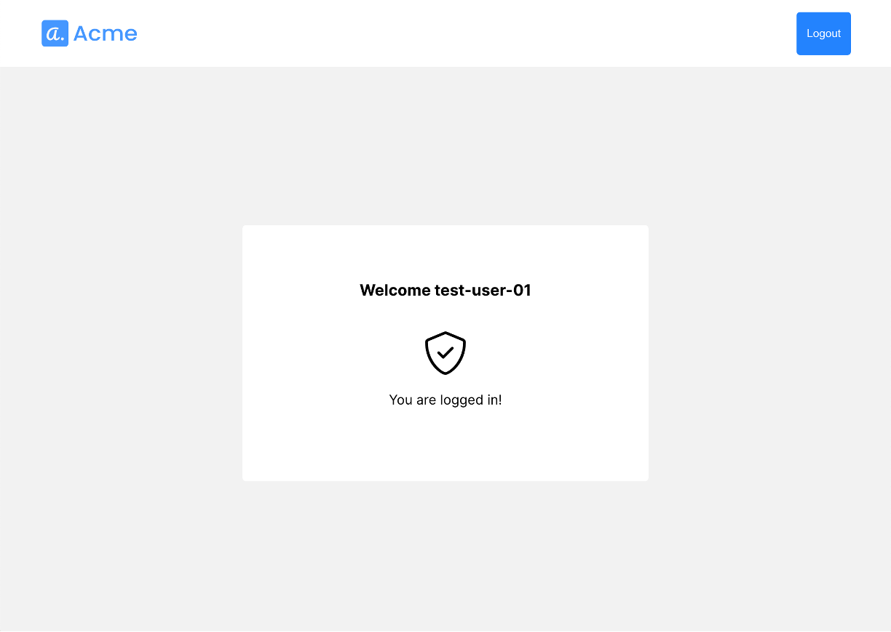

# Password Authentication

## 対象サンプルアプリケーション
- [password-authentication](https://github.com/TransmitSecurity/ciam-expressjs-vanilla-samples/tree/main/password-authentication)
- このサンプルアプリケーションはユーザ名・パスワードを利用した認証を確認することができます

## はじめに
- 本ドキュメントではサンプルアプリケーションの利用に関する手順を示します
- サンプルアプリケーションを[ローカル環境で実行](./setup.md#ローカル環境で実行)した際の手順を示しています。試される環境に合わせて適宜アクセスするURLなど変更して操作ください

### 事前準備・前提
- 本ドキュメントでは以下が必要となります
  - インターネットに接続可能な端末
  - ブラウザ
  - 手順に応じた簡易なCLI操作・ファイル編集

## サンプルアプリケーションの実行
```
SAMPLE=password-authentication yarn start
```

## 動作確認

### アプリケーション利用手順

#### 初回接続時：アカウントの登録

- ブラウザでサンプルアプリケーション([http://localhost:8080](http://localhost:8080))に接続します

- アプリケーション下部の`Sign up`をクリックしてください

  

- 作成するアカウントの`username`、`passsword`を入力し、`Sign up`をクリックしてください
- 作成する`password`は、Portalのパスワードポリシーの設定に従う必要があります。
  - Portal: 左側メニュー`Authentication`を開き、対象のアプリケーション`codespace-test`をプルダウンより選択してください。画面の`Passwords`を開き、パスワードポリシーを確認してください。初期設定のポリシーは以下です

  

- こちらのテスト実行では以下の内容を入力しています
  - `username` : test-user-01
  - `Password` : TestP@ssw0rd

  

- 正しく登録が完了すると、認証後を想定したサンプル画面が表示されます

  


- 画面右上のログアウトボタンより一度ログアウトします

#### ログイン成功の操作

- 先ほど登録したユーザ情報でログインします

  

- 正しくログインすることができました。この結果より先ほどのユーザ情報は正しくTransmit Securityに登録ができており、ユーザ認証が完了したことがわかります。
- ログイン後の画面は先ほどと同様で、Risk値を確認することができます
- ログアウトボタンより一度ログアウトします

#### ログイン失敗の操作

- 先ほど登録した情報とは異なる`username`を入力し、動作を確認します
  - `username` : test-user-02
  - `Password` : TestP@ssw0rd

- エラーにより認証が失敗しました

- 操作は以上です。Portalにてどのように情報が見えるか確認します

#### Portalの確認

> **Warning**
> Portalの機能、画面のデザインは日々アップデートされます。本ページの画像は参考情報としてご確認ください


##### Usersの確認

- 左のメニューから`Users`を開きます。対象のUser右側の`:`のボタンをクリックし、`User details`をクリックしてください

  

- `Activities`のタブを開いてください。DRSの機能により、通信制御の内容を確認することができます

  

  - 初期の表示では画面上部が最新となります
  - 実際に操作した内容の通りエントリが表示されていることが確認できます

<!--
## デバッグ
-->

## 参考情報
- [Login with passwords](https://developer.transmitsecurity.com/guides/user/auth_passwords/)


