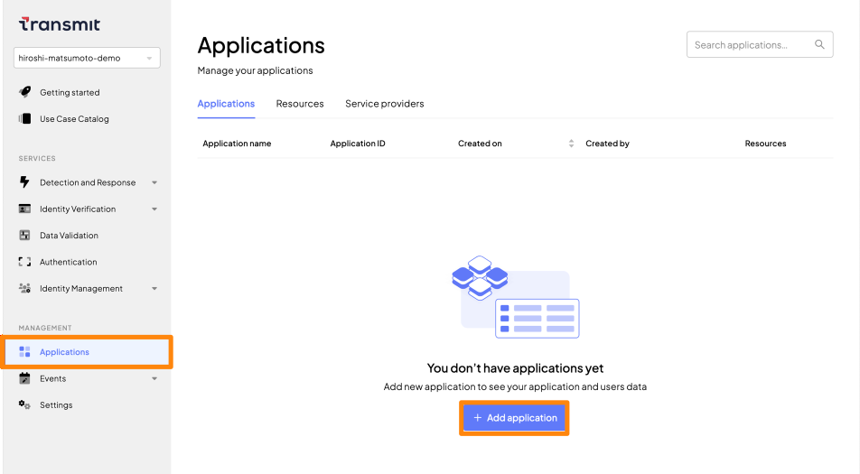

# 事前作業

## はじめに
- 本ドキュメントでは事前作業の手順を示します
- サンプルアプリケーション は主に以下のいずれかで動作を確認いただけます
  - [GitHubのCodeSpaceで実行](./setup.md#githubのcodespaceで実行)
  - [RepositoryをCloneし、ローカルで実行](./setup.md#ローカル環境で実行)
  - [Docker Container を利用し、ローカルで実行](./setup.md#docker-containerで実行)
- 環境に適した手順を参照してください

## GitHubのCodeSpaceで実行
- GitHub Codespaceを利用することでブラウザ上でサンプルアプリケーションを実行することが可能です
- GitHub Codespaceの利用には、GitHubアカウントが必要です。適切なアカウントでログインしてください
- 詳細は[Githubのページ](https://docs.github.com/ja/codespaces)を参照して下さい
- GitHub CodespaceはFreeプランでも一定の利用が可能となっています。Codespaceの実行リソースは利用者様のアカウントに紐づきますので、適宜ご確認の上ご利用ください。詳細は[GitHub Codespaces の請求について](https://docs.github.com/ja/billing/managing-billing-for-github-codespaces/about-billing-for-github-codespaces)を参照して下さい

### 1.Codespaces でサンプルアプリケーションの実行

- このリポジトリ、[Transmit Security Platform サンプルアプリケーション](https://github.com/TransmitSecurity/ciam-expressjs-vanilla-samples) を開き、`<> Code`ボタンをクリックし、タブ右側`Codespaces`を開いて下さい
- `Create codespace`または メニュー右上の`+`をクリックして下さい

  

- クリック後、Codespaceが実行されRepositoryの内容が展開されます。表示されたCodespaceの左メニュー上部にマウスを移動し、`New File`ボタンをクリックし、`.env`という名称でファイルを作成して下さい

  

- `sample.env`の内容を`.env`にコピーします。

  

- `TS_REDIRECT_URI`の値を指定します。これは、Transmit Security Platformで認証機能を用いた際に、利用する値となります。以下の内容を参考に指定して下さい

  > 2023/08/19現在、sample.env のコメント欄では`-8080.preview.app`となっていますがこちらのマニュアルの通り`preview`の文字列は不要となっています

  - `TS_REDIRECT_URI`: 作成したCodespaceのURLをブラウザのURL欄からコピーし貼り付けます。ホスト部に`-8080.app`を追加し、URLパスに`/complete`を追加します
  - `TS_REDIRECT_URI`は次の手順でも利用しますので、すぐにコピーできる状態にしておいて下さい
- その他の値は後ほど記述します


### 2.Transmit Security Platform にアプリケーションの登録

- [Transmit Security portal](https://portal.identity.security/)にアクセスし、ログインします
- Applicationを作成します。左のメニューより`Applications`を開き、`+Add applications`をクリックします

  

- 以下のパラメータを参考に設定します
  - `Application name`: codespace-test
  - `Public sign-up`: Allow registration を選択
  - `Client name`: codespace-test
  - `Redirect URI` : 前の手順で確認した`TS_REDIRECT_URI`のURI情報
- 画面最下部`Add`をクリックし、Applicationの作成を完了します

### 3.サンプルアプリケーションの設定を記述
- 設定を行ったアプリケーションの情報を`.env`ファイルの各パラメータの値として指定します
- [Transmit Security portal](https://portal.identity.security/)を開き、左のメニューより`Applications`を開きます
- 先ほど作成したアプリケーションを開きます。以下の内容を参考に、`Application ID`、`Client ID`、`Client Secret`の値を各パラメータの値として貼り付けます

  <p></p>

  <p></p>
  
- 以下の内容を参考にパラメータを設定します
  - `TS_REDIRECT_URI`: 先ほど作成した`TS_REDIRECT_URI`のURI情報(貼り付け済み)
  - `VITE_TS_CLIENT_ID`: `Client ID`の値
  - `TS_CLIENT_SECRET`: `Client Secret`の値
  - `TS_APP_ID`: `Application ID`の値

### 4.Transmit Security Platform にアプリケーションの設定追加
- [Transmit Security portal](https://portal.identity.security/)を開き、左のメニューより`Applications`を開きます
- 画面上部のメニューより先ほど作成したアプリケーションを開きます

  

- `Authentication methods`の欄から`WebAuthn`を選択します
  - `WebAuthn RP origin` : `Redirect URI`で指定したURI情報から末尾`/complete`を削除した文字列
  - `WebAuthn RP ID` : `WebAuthn RP origin`で指定した文字列の`FQDN`部分
- `Save`をクリックします

### 5.アプリケーションのビルド、実行
- `Codespace` の右下のターミナルを開きます。ターミナルが開かれていない場合には`TERMINAL`のタブをクリックして下さい
- 初期状態でサンプルアプリケーションが配置されたディレクトリ(/workspaces/ciam-expressjs-vanilla-samples)となっています。このディレクトリで以下コマンドを実行し、ビルドを行って下さい
    ```shell
    yarn
    ```
- ビルドが完了後、以下コマンドを実行し、サンプルアプリケーションを実行して下さい。以下のいずれかの手順で実行してください。実行例のサンプルアプリケーションは`login-with-email`です
  - `launch.sh`の実行。コマンド入力後、メニューが表示されますのでカーソルキーで選択し、Enterを押して下さい
    ```shell
    ./launch.sh
    ```
  

  - `yarn start`の実行。環境変数`SAMPLE`の値として実行するアプリケーションのディレクトリ名を指定し、実行してください
    ```
    SAMPLE=login-with-email yarn start
    ```

- 正しく起動すると、ブラウザでサンプルアプリケーションに接続可能になります。以下のいずれかの手順でアプリケーションに接続して下さい
  - 右下に表示されるポップアップの`Open in Browser`をクリック
  - `PORTS` のタブを開き、`Local Address`列の`WebPage🌐`をクリック
  - 正しくPORTが追加されない場合、`PORTS`のタブを開き、`Add Port`をクリックし`8080`を追加して下さい。その後、`Local Address`列の`WebPage🌐`をクリック


### 6.アプリケーションの停止

> **Warning**
> Codespaceはお客様アカウントに紐作りソースで動作しています。動作確認が完了後、アプリケーションを停止し、Codespaceを削除して下さい

- Codespaceの右下、`TERMINAL`のタブをクリックして下さい
- `Ctrl+C`を入力し、アプリケーションを停止させて下さい

- このリポジトリ、[Transmit Security Platform サンプルアプリケーション](https://github.com/TransmitSecurity/ciam-expressjs-vanilla-samples) を開き、`<> Code`ボタンをクリックし、タブ右側`Codespaces`を開いて下さい
- 実行中のものが表示されていますので`…`をクリックし`Delete`をクリックして下さい。確認のためポップアップが表示されますので`OK`をクリックして下さい


## ローカル環境で実行
- ローカル環境でサンプルアプリケーションの実行が可能です
- アプリケーションの実行に、Node.js を用います。以下のいずれかのバージョンをご用意ください
  - v14.18.0+
  - v16.0.0+
- 本作業手順は、以下Docker Imageでの実行結果を示しています。適宜ご利用環境に、ご利用ください

  - [Docker HUB node:gallium-bullseye](https://hub.docker.com/layers/library/node/gallium-bullseye/images/sha256-3fe7ccb4466419d065feac781091d6ba0d508397ecbea87d6e092847892ba761?context=explore)
  - 実行コマンドサンプル
    ```shell
    docker run --platform linux/amd64 -p 8080:8080 -it node:gallium-bullseye /bin/bash
    ```

### 1.ローカル環境でサンプルアプリケーションの実行
- ローカル環境で`git`コマンドを用いてサンプルアプリケーションのファイルを取得します

  ```shell
  cd ~/
  git clone https://github.com/TransmitSecurity/ciam-expressjs-vanilla-samples.git
  cd ~/ciam-expressjs-vanilla-samples/
  ```

- アプリケーションを実行する際にいくつかパラメータを指定します。`TS_REDIRECT_URI`は、 `http://localhost:8080/complete`となります。以降の手順ではこちらの値を指定してください

### 2.Transmit Security Platform にアプリケーションの登録
- [codespaceの手順](./setup.md#2transmit-security-platform-にアプリケーションの登録)の内容に従って作業をしてください

### 3.サンプルアプリケーションの設定を記述
- 設定を行ったアプリケーションの情報を`.env`ファイルの各パラメータの値として指定します
- [codespaceの手順](./setup.md#3サンプルアプリケーションの設定を記述)の内容に従って各パラメータを取得してください
- ターミナルで以下のいずれかの手順でファイルを生成してください
  - `sample.env`を`.env`というファイル名でコピーし、テキストエディタで内容を変更する
  - 以下コマンドを参考に`.env`ファイルを作成してください

    ```shell
    ## cd ~/ciam-expressjs-vanilla-samples/
    cat << EOF > .env
    TS_REDIRECT_URI=http://localhost:8080/complete
    VITE_TS_CLIENT_ID=<APP CLIENT ID>
    TS_CLIENT_SECRET=<APP CLIENT SECRET>
    TS_APP_ID=<APP ID>
    EOF
    ```

### 4.Transmit Security Platform にアプリケーションの設定追加
- [codespaceの手順](./setup.md#4transmit-security-platform-にアプリケーションの設定追加)の内容に従って作業をしてください
- パラメータに指定する内容は以下の内容としてください
  - `WebAuthn RP ID`: localhost
  - `WebAuthn RP origin`: http://localhost:8080

### 5.アプリケーションのビルド、実行
- アプリケーションの作業手順は、[codespaceの手順](./setup.md#5アプリケーションのビルド実行)と同様です
- アプリケーション実行後、ブラウザを開き、`http://localhost:8080`へアクセスしてください

### 6.アプリケーションの停止
- アプリケーションの利用終了後、ターミナルで`Ctrl-C`を入力し、アプリケーションを停止してください


## Docker Containerで実行
- サンプルアプリケーションをDockerで実行する際に、`SAMPLE`の値にテストを行うサンプルアプリケーションを指定します。実行するアプリケーションは、[GitHubの内容](https://github.com/TransmitSecurity/ciam-expressjs-vanilla-samples)を確認してください
- アプリケーションを実行する際にいくつかパラメータを指定します。`TS_REDIRECT_URI`は、 `http://localhost:8080/complete`となります。以降の手順ではこちらの値を指定してください

### 1.Transmit Security Platform にアプリケーションの登録
- [codespaceの手順](./setup.md#1codespaces-でサンプルアプリケーションの実行)の内容に従って作業をしてください

### 2.Transmit Security Platform にアプリケーションの設定追加
- [codespaceの手順](./setup.md#2transmit-security-platform-にアプリケーションの登録)の内容に従って作業をしてください
- パラメータに指定する内容は以下の内容としてください
  - `WebAuthn RP ID`: localhost
  - `WebAuthn RP origin`: http://localhost:8080

### 3.アプリケーションの実行
- 設定を行ったアプリケーションの情報をDocker Container実行の際にパラメータの値として指定します
- [codespaceの手順](./setup.md#3サンプルアプリケーションの設定を記述)の内容に従って各パラメータを取得してください
- 実行コマンドのサンプルは以下です。適宜値を変更して利用してください。実行例のサンプルアプリケーションは`login-with-email`です

  ```shell
  docker run --platform linux/amd64 \
  -e SAMPLE=login-with-email  \
  -e TS_REDIRECT_URI=http://localhost:8080/complete  \
  -e VITE_TS_CLIENT_ID=<APP CLIENT ID>  \
  -e TS_CLIENT_SECRET=<APP CLIENT SECRET>  \
  -e TS_APP_ID=<APP ID>  \
  -p 8080:8080 transmitsecurity/js-vanilla-samples:latest
  ```

- アプリケーション実行後、ブラウザを開き、`http://localhost:8080`へアクセスしてください

### 4.アプリケーションの停止
- アプリケーションの利用終了後、ターミナルで`Ctrl-C`を入力し、アプリケーションを停止してください


